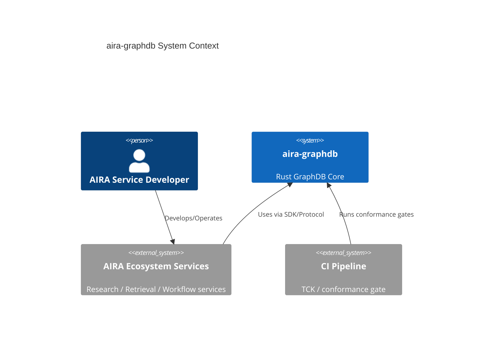
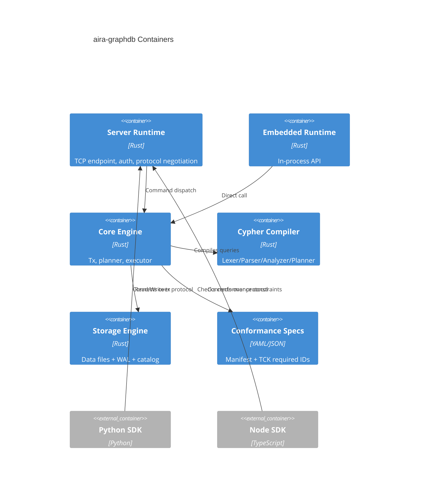
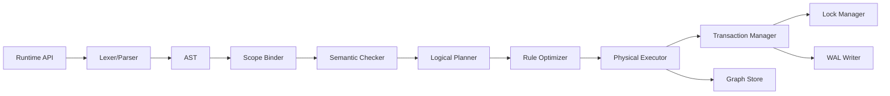

# DES-AIRA-GRAPHDB-001: aira-graphdb 設計書（Phase 2）

| フィールド | 値 |
|-----------|---|
| **ID** | DES-AIRA-GRAPHDB-001 |
| **バージョン** | 1.7 |
| **ステータス** | Draft |
| **作成日** | 2026-06-20 |
| **更新日** | 2026-06-21 |
| **要件参照** | `spec/REQ-AIRA-GRAPHDB-001.md` (v1.9) |
| **対象バージョン** | v0.2.0 |

## 0. 実行コンテキスト（受入試験）

- `cargo ...` 系コマンドは `aira-graphdb` リポジトリで実行する。
- `npm --workspace packages/memgraphrag ...` 系コマンドは `aira-synapse` リポジトリで実行する。
- CI の正準エントリポイントは `aira-synapse` 側 workflow `.github/workflows/aira-synapse-backend-compat.yml` の job `backend-compat` とする。

## 1. 設計方針

- Rust コアを単一実装とし、**Embedded** / **Server** の2モードを同一エンジンで提供する。
- Cypher 実行は `AGDB-CYPHER-OPENCYPHER9@1.0.0` を下位基準とし、Neo4j 互換ベースラインを含めてダイアレクト別に実装する。
- 性能を優先し、Neo4j 互換は意味保存を損なわない範囲に限定する。
- openCypher 9 準拠は **TCK 固定スナップショット** と **closed-world manifest** で機械検証する。
- Python/Node SDK は同一 Wire Protocol と同一エラー契約を共有する。

## 2. C4 モデル

### 2.1 Context



### 2.2 Container



### 2.3 Component（Cypher Compiler + Executor）



## 3. DES 仕様

### DES-AGDB-001: Core Domain & Storage

**トレーサビリティ**: REQ-AGDB-001, REQ-AGDB-007, REQ-AGDB-008, REQ-AGDB-010, REQ-AGDB-014  
**パッケージ**: `packages/aira-graphdb`

**設計概要**:
- Node/Edge/Property モデルと WAL ベース耐久化を Core に配置する。
- COMMIT 成功応答は WAL flush 完了後にのみ返す。
- Recovery は redo/replay 後に整合性検証し、部分反映を検出した場合は起動失敗する。
- DBオープン時に format header/version を検証し、非互換時は `INCOMPATIBLE_FORMAT` を返してファイルを書き換えない。
- Recovery 整合性違反の検出時は起動失敗と同時に監査ログへ記録する。
- `aira-synapse` 互換の storage-port adapter 境界（`IGraphStore/IVectorIndex/IMemoryStore/IGraphProjection/ILexicalRetriever`）を Interface 層に配置し、契約テストで固定する。
- vector/lexical 互換評価器を Application 層に配置し、`memoryType=passage|fact` の統合結果スキーマ、score 降順・同点時 documentId 昇順、baseline backend（neo4j）との集合一致を検証可能にする。
- backend ルーティング/フォールバック戦略（`sqlite|ladybug|neo4j|aira-graphdb`）と失敗時の固定エラーコード写像を Infrastructure 層で実装する。
- CI release-block 設計として `.github/workflows/aira-synapse-backend-compat.yml` の `backend-compat` を Required Check にし、失敗レポートの最小スキーマを `{ errorCode, failedCompatibilityTestId }` とする。

```ts
export type NodeId = string;
export type EdgeId = string;

export interface GraphNode {
  id: NodeId;
  labels: string[];
  properties: Record<string, unknown>;
}

export interface GraphEdge {
  id: EdgeId;
  from: NodeId;
  to: NodeId;
  type: string;
  properties: Record<string, unknown>;
}

export interface StoragePort {
  loadSnapshot(path: string): Promise<void>;
  flushWAL(txId: string): Promise<void>;
  recover(path: string): Promise<void>;
}

export interface AuditLogPort {
  record(eventType: string, payload: Record<string, unknown>): Promise<void>;
}
```

**CLI契約**: `cargo run -p aira-graphdb -- db check|recover|verify|open`

---

### DES-AGDB-002: Runtime Modes & Concurrency

**トレーサビリティ**: REQ-AGDB-002, REQ-AGDB-003, REQ-AGDB-013  
**パッケージ**: `packages/aira-graphdb`

**設計概要**:
- `EmbeddedRuntime` は in-process で `CoreEngine` を直接呼び出す。
- `ServerRuntime` はセッション、認証、トランザクション境界を管理する。
- 同一DBファイルへの二重 writer は `WRITE_LOCK_CONFLICT` を返す。
- lock 取得失敗時は write path に入らず、DBファイルを変更しない。
- `P0-SERVER-CONCURRENCY` では最小 32 同時接続を保証し、超過時はバックプレッシャで制御する。

```ts
export type DeploymentMode = "EMBEDDED" | "SERVER";

export interface RuntimeConfig {
  mode: DeploymentMode;
  dbFilePath: string;
  serverPort?: number;
  concurrencyProfile?: "P0-SERVER-CONCURRENCY";
}

export interface Runtime {
  start(config: RuntimeConfig): Promise<void>;
  stop(): Promise<void>;
}

export interface ConcurrencyGuard {
  minConcurrentConnections: 32;
  enforceBackpressure: true;
}
```

**CLI契約**: `cargo run -p aira-graphdb -- embedded open|server start|lock test`

---

### DES-AGDB-003: Protocol & Error Contract

**トレーサビリティ**: REQ-AGDB-004, REQ-AGDB-009, REQ-AGDB-015, REQ-AGDB-016  
**パッケージ**: `packages/aira-graphdb`, `sdk/node`, `sdk/python`

**設計概要**:
- ハンドシェイク時に `protocol_version` と `canonical_type_system_version` を交渉する。
- SDK/CLI/Server の失敗は `AGDB-ERROR-CODES@1.0.0` に 1:1 マップする。
- 認証境界は TLS1.3 + JWT 検証を共通実装で強制する。
- JWT 検証では `alg` 許可リスト、`alg=none` 拒否、`kid` 一意解決、`iss/aud/exp/nbf` 検証を必須化する。
- 未認証要求は `AUTH_REQUIRED`、検証失敗は `AUTH_FAILED` を返す。
- セッション状態を `CONNECTED -> TLS_OK -> AUTH_OK -> APP_READY` で管理し、`APP_READY` 前のアプリ要求を拒否する。
- 型変換は `AGDB-TYPEMAP-P0@1.0.0` の codec resolver で一元適用し、Python/Node 同値を保証する。
- 認証失敗と未認証要求の拒否イベントは監査ログへ記録する。

```ts
export interface HandshakeRequest {
  protocolVersion: string;
  canonicalTypeSystemVersion: string;
}

export interface HandshakeResponse {
  accepted: boolean;
  protocolVersion?: string;
  canonicalTypeSystemVersion?: string;
  errorCode?: "PROTOCOL_VERSION_MISMATCH";
}

export interface ErrorContract {
  code: string;
  message: string;
  details?: Record<string, unknown> & {
    unsupported_clause?: string;
  };
}

export interface TypeMapResolver {
  encode(value: unknown): Promise<Uint8Array>;
  decode(payload: Uint8Array): Promise<unknown>;
  canonicalVersion(): "AGDB-TYPEMAP-P0@1.0.0";
}
```

**CLI契約**: `cargo run -p aira-graphdb -- server protocol-version|query|errors list`

---

### DES-AGDB-004: openCypher 9 Compiler & Execution Semantics

**トレーサビリティ**: REQ-AGDB-005, REQ-AGDB-006  
**パッケージ**: `packages/aira-graphdb`

**設計概要**:
- Compiler は `Lexer -> Parser -> Binder -> SemanticChecker -> Planner -> Optimizer -> Executor` で構成する。
- 主要句は `MATCH`, `OPTIONAL MATCH`, `WHERE`, `WITH`, `RETURN`, `ORDER BY`, `SKIP`, `LIMIT`, `CREATE`, `MERGE`, `DELETE`, `DETACH DELETE`, `SET`, `REMOVE`, `UNWIND`, `CALL` を含む。
- Neo4j 互換ダイアレクトは `UNION`, `FOREACH`, `CASE`, `EXISTS {}` / `CALL {}` サブクエリ, variable-length path, shortest path, pattern comprehension, schema/index 操作を baseline feature manifest で制御する。
- `WITH` のスコープ分離、別名解決、集約評価は SemanticChecker が担当し、Planner は再利用可能な形に正規化する。
- `ORDER BY` なし read は multiset 同値、`ORDER BY` ありは順序同値で検証する。
- 準拠範囲外機能は部分更新を許さず `UNSUPPORTED_FEATURE` を返す。
- `UNSUPPORTED_FEATURE` 返却時は `details.unsupported_clause` に非対応句名を必須格納する。

```ts
export interface QueryCompiler {
  parse(cypher: string): Promise<AstNode>;
  analyze(ast: AstNode): Promise<AnalyzedQuery>;
  plan(analyzed: AnalyzedQuery): Promise<ExecutionPlan>;
}

export interface QueryExecutor {
  execute(plan: ExecutionPlan, txId?: string): Promise<QueryResult>;
}

export interface QueryResult {
  columns: string[];
  rows: unknown[][];
}

export type CypherClauseKind =
  | "MATCH"
  | "OPTIONAL MATCH"
  | "WHERE"
  | "WITH"
  | "RETURN"
  | "ORDER BY"
  | "SKIP"
  | "LIMIT"
  | "CREATE"
  | "MERGE"
  | "DELETE"
  | "DETACH DELETE"
  | "SET"
  | "REMOVE"
  | "UNWIND"
  | "CALL"
  | "UNION"
  | "UNION ALL"
  | "FOREACH"
  | "CASE"
  | "EXISTS"
  | "LOAD CSV"
  | "CALL SUBQUERY"
  | "SHORTEST PATH"
  | "PATTERN COMPREHENSION"
  | "CREATE INDEX"
  | "DROP INDEX"

export interface ClauseSupportMatrix {
  readClauses: CypherClauseKind[];
  writeClauses: CypherClauseKind[];
  callSubsets: string[];
  unsupportedBehavior: "UNSUPPORTED_FEATURE";
  partialExecutionForbidden: true;
}

export interface CypherNormalizationRule {
  pattern: string;
  normalizedForm: string;
  preservesSemantics: true;
}

export type CypherDialect = "OPENCYPHER9" | "NEO4J_COMPAT";

export interface CypherDialectResolver {
  resolve(query: string): Promise<CypherDialect>;
}

export interface Neo4jCompatFeatureManifest {
  manifestId: "agdb-cypher-neo4j-compat.v1.0.0";
  baselineMode: "closed_world";
  allowedFeatures: Array<{
    featureId: string;
    clause: string;
    status: "required" | "unsupported";
    coversReq: string[];
    coversAcceptance: string[];
  }>;
}
```

**CLI契約**: `cargo run -p aira-graphdb -- query "<cypher>"`

---

### DES-AGDB-005: Integrity & Transaction Semantics

**トレーサビリティ**: REQ-AGDB-008, REQ-AGDB-010, REQ-AGDB-011, REQ-AGDB-012, REQ-AGDB-015  
**パッケージ**: `packages/aira-graphdb`

**設計概要**:
- 競合書込みは `SERIALIZABLE` を維持し、`COMMIT` または `RETRYABLE_CONFLICT` を返す。
- 競合解決は lock 取得順序と txId タイブレーク規則で決定化し、同一スケジュールで同一終了結果を返す。
- エッジ create/update 時に始点/終点ノード存在を検証し、欠損時は `REFERENTIAL_INTEGRITY_VIOLATION` を返す。
- 参照整合性は `DETACH DELETE` 明示時のみ連鎖削除を許可する。
- 参照中ノードの通常削除は `REFERENTIAL_INTEGRITY_VIOLATION` を返して拒否する。
- rollback、整合性違反、認証失敗イベントは監査ログへ記録する。

```ts
export interface TransactionPort {
  begin(): Promise<string>;
  commit(txId: string): Promise<void>;
  rollback(txId: string): Promise<void>;
}

export interface DeleteNodeCommand {
  nodeId: string;
  detachDelete?: boolean;
}
```

**CLI契約**: `cargo run -p aira-graphdb -- tx conflict-test|query`

---

### DES-AGDB-006: Conformance Gate & Manifest Synchronization

**トレーサビリティ**: REQ-AGDB-017, REQ-AGDB-018  
**パッケージ**: `packages/aira-graphdb`, `spec/conformance`, `spec/contracts`

**設計概要**:
- `opencypher9-tck-required.yaml` と `opencypher9-required-tests.yaml` の両方を必須入力として CI で実行し 100% PASS を要求する。
- `opencypher9-tck-required.yaml` は commit SHA 固定の snapshot_ref でのみ受理する。
- `agdb-cypher-opencypher9.v1.0.0.json` は closed-world で規範機能分類を保持する。
- `normative_feature_count == classified_normative_feature_count` と `covers_tck_ids` 全被覆を同時検証する。
- `covers_req` / `covers_acceptance` の存在、必須 negative ケース（syntax/unsupported/partial-update）の存在、互換性レポート保存をリリースゲートで検証する。
- `full_support=true` の場合、規範機能の `status` は全件 `required` でなければならず、1件でも `unsupported` があればゲート失敗とする。
- Decision source は `ADR-AGDB-002` とする。

```ts
export interface ConformanceManifest {
  spec_id: "AGDB-CYPHER-OPENCYPHER9@1.0.0";
  full_support: true;
  coverage_mode: "closed_world";
  snapshot_ref: string;
  normative_feature_count: number;
  classified_normative_feature_count: number;
  covers_tck_ids: string[];
  features: Array<{
    feature_id: string;
    normative: boolean;
    status: "required" | "unsupported";
  }>;
}

export interface ConformanceGate {
  runRequiredTck(): Promise<ConformanceReport>;
  runRequiredScenarioSuite(): Promise<ConformanceReport>;
  verifyManifestSync(): Promise<void>;
  verifyTraceabilityMetadata(): Promise<void>;
  verifyMandatoryNegativeCases(): Promise<void>;
  persistCompatibilityReport(report: ConformanceReport): Promise<void>;
}

export interface ConformanceReport {
  passRate: number;
  failedTestIds: string[];
  featureResults: Array<{
    featureId: string;
    clause: string;
    status: "pass" | "fail";
    evidence: string;
  }>;
}
```

**CLI契約**: `cargo test --test cypher_conformance -- --nocapture`

---

### DES-AGDB-007: 非機能要件（レイテンシ）

**トレーサビリティ**: REQ-AGDB-NF-001  
**パッケージ**: `packages/aira-graphdb`

**設計概要**:
- `P0-LATENCY-BASELINE` ベンチマークを固定条件で実行する。
- 単純 MATCH/RETURN の P95 を収集し、結果をレポート保存する。
- P95 が 50ms を超えた場合は CI quality gate を fail とし、リリースをブロックする。

```ts
export interface LatencyBenchmarkConfig {
  profile: "P0-LATENCY-BASELINE";
  datasetNodes: number;
  concurrency: number;
}
```

**CLI契約**: `cargo run -p aira-graphdb -- bench latency`

---

### DES-AGDB-008: 非機能要件（将来クラスタ移行メタデータ）

**トレーサビリティ**: REQ-AGDB-NF-002  
**パッケージ**: `packages/aira-graphdb`

**設計概要**:
- system catalog に partition/replica メタデータをバージョン付きで保持する。
- catalog schema version と移行手順の整合を検証可能にする。

```ts
export interface ClusterMetadataCatalog {
  catalogSchemaVersion: string;
  partitions: Array<{ id: string; range: string }>;
  replicas: Array<{ partitionId: string; replicas: string[] }>;
}
```

**CLI契約**: `cargo run -p aira-graphdb -- catalog show`

---

### DES-AGDB-009: aira-synapse ストレージポート互換アダプター

**トレーサビリティ**: REQ-AGDB-019  
**パッケージ**: `packages/aira-graphdb`, `packages/memgraphrag`

**設計概要**:
- `IGraphStore` / `IVectorIndex` / `IMemoryStore` / `IGraphProjection` / `ILexicalRetriever` に対する 1:1 adapter 実装を Interface 層に配置する。
- アダプター境界で入力正規化・出力整形・例外写像を統一し、失敗時は `AGDB-ERROR-CODES@1.0.0` を返す。
- 契約互換は `spec/contracts/aira-synapse-storage-ports.v1.0.0.json` を唯一の契約ソースとして検証する。
- 契約検証は `tests/contracts/aira_synapse_storage_ports_contract.spec.ts` を release-block 条件とし、JSON 契約ケースの PASS 率 100% を必須にする。
- 統合互換は `tests/integration/storage-port-compat/*.spec.ts` も release-block 条件とし、PASS 率 100% を必須にする。

```ts
export interface AiraSynapseStorageAdapterBundle {
  graphStore: IGraphStore;
  vectorIndex: IVectorIndex;
  memoryStore: IMemoryStore;
  graphProjection: IGraphProjection;
  lexicalRetriever: ILexicalRetriever;
}

export interface PortErrorMapper {
  toAgdbError(input: unknown): { code: string; message: string };
}
```

**CLI契約**: `MEMGRAPHRAG_BACKEND=aira-graphdb npm run test --workspace packages/memgraphrag -- tests/contracts/aira_synapse_storage_ports_contract.spec.ts && MEMGRAPHRAG_BACKEND=aira-graphdb npm run test --workspace packages/memgraphrag -- tests/integration/storage-port-compat`

---

### DES-AGDB-010: ベクトル/全文検索互換評価

**トレーサビリティ**: REQ-AGDB-020  
**パッケージ**: `packages/aira-graphdb`, `packages/memgraphrag`

**設計概要**:
- ベクトル互換は `upsert/search/deleteByDocument` の3操作を対象にし、`search` では `corpusId/namespace/topK` を必須、`threshold` は任意（指定時のみ適用）として評価する。
- 全文検索は `memoryType=passage|fact` を統合し、返却スキーマを `documentId/text/score/memoryType` に固定する。
- ランキング規則は `score DESC, documentId ASC` を固定し、同一データセット比較で再現可能にする。
- 不正な `topK/threshold/corpusId/namespace` は validator で拒否し、`AGDB-ERROR-CODES@1.0.0` の固定エラーコードへ写像する。
- negative test は `tests/integration/vector-lexical-negative.spec.ts` で固定し、各不正入力ケースのエラーコード一致を必須にする。
- baseline backend（neo4j）比較では `matchRate === 1.0`（`threshold` 指定時は適用後集合）を必須とし、逸脱時は CI fail とする。
- `deleteByDocument` 実行後は対象 documentId の検索ヒット 0 件を必須とし、逸脱時は CI fail とする。

```ts
export interface VectorCompatEvaluator {
  upsert(input: {
    documentId: string;
    corpusId: string;
    namespace: string;
    embedding: number[];
    text: string;
  }): Promise<void>;
  compareTopK(
    query: string,
    options: { corpusId: string; namespace: string; topK: number; threshold?: number }
  ): Promise<{ baselineSet: string[]; candidateSet: string[]; matchRate: number }>;
  deleteByDocument(input: { corpusId: string; namespace: string; documentId: string }): Promise<void>;
  assertDeleted(documentId: string, options: { corpusId: string; namespace: string }): Promise<void>;
}

export interface LexicalResult {
  documentId: string;
  text: string;
  score: number;
  memoryType: "passage" | "fact";
}

export interface SearchInputValidator {
  validateTopK(topK: number): void;
  validateThreshold(threshold?: number): void;
  validateCorpusAndNamespace(corpusId: string, namespace: string): void;
}
```

**CLI契約**: `cargo test --test aira_synapse_adapter_vector_lexical -- --nocapture && MEMGRAPHRAG_BACKEND=aira-graphdb npm run test --workspace packages/memgraphrag -- tests/integration/vector-lexical-negative.spec.ts`

---

### DES-AGDB-011: バックエンド切替互換とCI release-block

**トレーサビリティ**: REQ-AGDB-021  
**パッケージ**: `packages/aira-graphdb`, `packages/memgraphrag`, `.github/workflows`

**設計概要**:
- `sqlite|ladybug|neo4j|aira-graphdb` の backend ルーティングを同一 factory 抽象で切り替え、未処理例外を固定エラーコードへ写像する。
- P0 共通ユースケース正準リスト（REQ-AGDB-021）を互換テストIDに 1:1 で結び、baseline backend（neo4j）と成功/失敗判定・戻り値スキーマ・失敗時エラーコードを比較する。
- `.github/workflows/aira-synapse-backend-compat.yml` の `backend-compat` を Required Check とし、失敗レポートの最小スキーマを `{ errorCode, failedCompatibilityTestIds[] }` に固定する。
- release-block では `spec/contracts/p0-compat-test-map.v1.0.0.json` を正準マップとして参照し、`AGDB-P0-UC-001..006` が `storage-port-compat:*` / `backend-compat:*` に 1:1 で解決されることを検証する。
- 失敗レポートは `spec/contracts/backend-compat-failure-report.v1.0.0.json` で検証し、`status="fail"` の場合は `errorCode` と `failedCompatibilityTestIds[]`（非空配列）の必須性を保証する。
- 代表IDは `failedCompatibilityTestIds[0]` を参照値として扱う。
- Required Check 強制は `spec/contracts/branch-protection-policy.v1.0.0.json` を正準ポリシーとして監査し、`gh api repos/{owner}/{repo}/branches/{branch}/protection/required_status_checks` で差分検証する。

```ts
export interface BackendCompatReport {
  backend: "sqlite" | "ladybug" | "neo4j" | "aira-graphdb";
  status: "pass";
}

export interface BackendCompatFailureReport {
  backend: "sqlite" | "ladybug" | "neo4j" | "aira-graphdb";
  status: "fail";
  errorCode: string;
  failedCompatibilityTestIds: [string, ...string[]];
}

export type BackendCompatReportUnion = BackendCompatReport | BackendCompatFailureReport;

export interface P0CoverageGate {
  verifyCanonicalMap(mapPath: string): Promise<void>;
  verifyExecutedIds(requiredIds: string[], executedIds: string[]): Promise<void>;
}
```

**CLI契約**: `npm run test --workspace packages/memgraphrag -- tests/integration/storage-port-compat && npm run test --workspace packages/memgraphrag -- tests/integration/backend-compat && cargo test --test aira_synapse_adapter_integration`

---

### DES-AGDB-012: Native Read/Write 性能最適化

**トレーサビリティ**: REQ-AGDB-NF-003, REQ-AGDB-NF-004  
**パッケージ**: `packages/aira-graphdb`, `packages/memgraphrag`

**設計概要**:
- Native sidecar の state 永続化は「1 API リクエスト = 1 原子的永続化単位」を満たすよう write path を設計する。
- write path は全量 pretty-print 書込みを避け、差分ログ + 原子的ファイル置換（temp file + rename）で障害耐性とスループットを両立する。
- read path はノード/エッジ/ベクトル/全文索引でメモリ常駐インデックスを維持し、`get_node/get_adjacent/vector_search/lexical_search` の P95 目標を満たす。
- `P0-NATIVE-READ` / `P0-NATIVE-WRITE` ベンチは固定条件（データ規模、同時接続、ウォームアップ、測定回数）で実行し、結果を CI アーティファクト化する。
- 書込み成功応答（ack）は `temp file write -> file fsync -> atomic rename -> directory fsync` 完了後にのみ返す。
- CI では NF-003/NF-004 のしきい値を満たさない場合に bench ジョブを fail し、release をブロックする。

```ts
export interface NativeWriteDurabilityPolicy {
  atomicUnit: "per_request";
  persistStrategy: "tempfile_rename";
  crashSafety: "committed_all_or_uncommitted_none";
  ackAfter: "file_fsync_and_rename_and_dir_fsync";
  faultInjection: "kill_after_write_before_ack";
}

export interface NativeReadBenchmarkProfile {
  name: "P0-NATIVE-READ";
  datasetNodes: 100000;
  datasetVectors: 100000;
  warmupSeconds: 60;
  requestsPerApi: 10000;
  concurrency: 8;
  queryTopK: 10;
  p95TargetsMs: {
    getNode: 5;
    getAdjacent: 10;
    vectorSearch: 30;
    lexicalSearch: 30;
  };
}

export interface NativeWriteBenchmarkProfile {
  name: "P0-NATIVE-WRITE";
  totalWrites: 10000;
  batchSize: 100;
  concurrency: 8;
  persistenceEnabled: true;
  p95TargetMs: 25;
  throughputTargetMsFor10kWrites: 8000;
}

export interface NativePerfGate {
  failIfP95ExceedsTargets: true;
  failIfWriteThroughputExceedsMs: 8000;
  artifactPath: "artifacts/native-bench-report.json";
}
```

**CLI契約**: `cargo run -p aira-graphdb -- bench native-read && cargo run -p aira-graphdb -- bench native-write`

---

### DES-AGDB-013: Native 通信層レジリエンス/継続稼働

**トレーサビリティ**: REQ-AGDB-NF-005  
**パッケージ**: `packages/aira-graphdb`, `packages/memgraphrag`

**設計概要**:
- JSON-RPC エラーハンドリングは「リクエスト単位失敗でプロセス継続」を原則とし、入力種別ごとに固定コードを 1:1 写像する。
- エラーコード写像は `INVALID_REQUEST_JSON`（不正JSON）、`UNSUPPORTED_FEATURE`（未知メソッド）、`REQUEST_EXECUTION_FAILED`（実行失敗）を必須とする。
- `REQUEST_EXECUTION_FAILED` は `INTERNAL_BUG | IO_FAILURE | OOM | TIMEOUT | CLIENT_INPUT` の closed enum で failureClass を付与する。
- soak 実行時の内部障害率は `REQUEST_EXECUTION_FAILED` かつ failureClass=`INTERNAL_BUG | IO_FAILURE | OOM | TIMEOUT` を分子、成功・失敗を含む総リクエスト件数を分母として算出する。
- 異常系イベントは監査ログへ必ず記録し、`errorCode`, `failureClass`, `requestId`, `timestamp` を必須フィールドとする。
- sidecar 異常終了は supervisor/watchdog が検知し、`processExitCode`, `signal`, `lastRequestId`, `uptimeSec` を監査ログへ記録する。
- 不正JSON・未知メソッド・単一実行失敗の3ケースは JSON-RPC エラーレスポンス契約で検証し、回帰テストで固定化する。

```ts
export interface NativeRpcErrorMapping {
  invalidJson: "INVALID_REQUEST_JSON";
  unknownMethod: "UNSUPPORTED_FEATURE";
  executionFailure: "REQUEST_EXECUTION_FAILED";
}

export type NativeFailureClass =
  | "INTERNAL_BUG"
  | "IO_FAILURE"
  | "OOM"
  | "TIMEOUT"
  | "CLIENT_INPUT";

export interface NativeRpcRequestErrorResponse {
  requestId: string;
  code: "INVALID_REQUEST_JSON" | "UNSUPPORTED_FEATURE";
  message: string;
  details?: Record<string, unknown>;
  failureClass: "CLIENT_INPUT";
}

export interface NativeRpcExecutionFailureResponse {
  requestId: string;
  code: "REQUEST_EXECUTION_FAILED";
  message: string;
  details?: Record<string, unknown>;
  failureClass: NativeFailureClass;
}

export type NativeRpcErrorResponse =
  | NativeRpcRequestErrorResponse
  | NativeRpcExecutionFailureResponse;

export interface NativeRequestAuditEvent {
  errorCode: string;
  failureClass: NativeFailureClass;
  requestId: string;
  timestamp: string;
}

export interface NativeCrashAuditEvent {
  errorCode: "PROCESS_CRASH";
  timestamp: string;
  processExitCode: number | null;
  signal: string | null;
  lastRequestId: string | null;
  uptimeSec: number;
}

export interface NativeSoakSlo {
  profile: "P0-NATIVE-SOAK";
  durationHours: 24;
  maxCrashCount: 0;
  maxInternalFailureRate: 0.001;
  numeratorFailureClasses: ["INTERNAL_BUG", "IO_FAILURE", "OOM", "TIMEOUT"];
  denominator: "all_requests_including_success_and_failure";
}

export interface NativeRpcResilienceContractTest {
  invalidJsonCase: "returns_INVALID_REQUEST_JSON_and_process_alive";
  unknownMethodCase: "returns_UNSUPPORTED_FEATURE_and_process_alive";
  executionFailureCase: "returns_REQUEST_EXECUTION_FAILED_and_process_alive";
}
```

**CLI契約**: `cargo run -p aira-graphdb -- soak native-rw --hours 24 && cargo test --test native_rpc_resilience -- --nocapture`

---

### DES-AGDB-014: 関係走査 + CALL/APOC サブセット実行設計

**トレーサビリティ**: REQ-AGDB-022, REQ-AGDB-023  
**パッケージ**: `packages/aira-graphdb`, `spec/conformance`, `spec/contracts`

**設計概要**:
- 関係走査 `()-[]->()` / `()-[]-()` の実行を Planner/Executor に追加し、`MATCH/OPTIONAL MATCH/WHERE/WITH/RETURN` の句評価規則を固定する。
- 関係走査の検証対象は `spec/conformance/rel-traversal-required.v1.0.0.yaml` で固定し、ordered query は `exact_order`、unordered query は `multiset` で比較する。
- `CALL` 実行は `spec/contracts/apoc-procedure-manifest.v1.0.0.yaml` の `allowed_procedures` を正とするホワイトリスト方式で実装する。
- 未許可 procedure は `UNSUPPORTED_FEATURE` を返し、部分実行禁止（`partial_execution_forbidden=true`）を適用する。
- `side_effect=true` procedure（例: `apoc.refactor.rename.label`）は transaction atomic で実行し、失敗時は rollback を強制する。
- `CALL` は引数検証、返却列スキーマ検証、procedure 名の正規化を行い、許可済みサブセット以外を実行しない。

```ts
export interface RelationshipTraversalConformanceCase {
  id: string;
  query: string;
  assertion: "expected_rows" | "expected_rows_with_nulls" | "expected_order";
}

export interface CallProcedureManifest {
  version: "1.0.0";
  allowedProcedures: Array<{
    name: string;
    sideEffect: boolean;
    failureCodes: string[];
    atomicity?: "transaction_atomic";
  }>;
  errorPolicy: {
    unlistedProcedure: "UNSUPPORTED_FEATURE";
    partialExecutionForbidden: true;
  };
}
```

**CLI契約**: `cargo test --test cypher_conformance -- --nocapture && cargo run -p aira-graphdb -- query "CALL apoc.meta.schema()"`

---

### DES-AGDB-015: 実ランタイム Soak Runner + 外部 Watchdog 設計

**トレーサビリティ**: REQ-AGDB-NF-006, REQ-AGDB-NF-007  
**パッケージ**: `packages/aira-graphdb`, `.github/workflows`, `tests`

**設計概要**:
- soak 実行は実 sidecar プロセスを起動して read/write 混在負荷を送る runtime-runner とし、`P0-NATIVE-SOAK-SMOKE`（30分）/`P0-NATIVE-SOAK`（24h）を eventType で切替える。
- watchdog は sidecar を別プロセスで監視し、`SIGKILL` 等の in-process hook 非捕捉終了も `PROCESS_CRASH` として監査ログへ記録する。
- crash 監査ログ必須項目は `errorCode,timestamp,processExitCode,signal,lastRequestId,uptimeSec,cause` に固定する。
- quality gate は crash count と internal failure rate を判定し、監査ログ必須項目欠落時は fail する。
- 出力artifactは `artifacts/soak-summary.json` と `artifacts/watchdog-crash-report.json` を正とし、`soak-summary.json` に `profile,durationMinutes,totalRequests,internalFailureRate,crashCount`、`watchdog-crash-report.json` に `events[]`（`PROCESS_CRASH` 必須項目）を固定する。
- gate 判定式は `crashCount == 0 AND internalFailureRate <= 0.001 AND requiredFieldsValid == true` とし、eventType ごとに `pull_request -> P0-NATIVE-SOAK-SMOKE`、`schedule/release -> P0-NATIVE-SOAK` を適用する。

```ts
export interface RuntimeSoakRunnerConfig {
  profile: "P0-NATIVE-SOAK-SMOKE" | "P0-NATIVE-SOAK";
  durationMinutes: 30 | 1440;
  targetProcess: "aira-graphdb-native";
}

export interface ExternalWatchdogCrashEvent {
  errorCode: "PROCESS_CRASH";
  timestamp: string;
  processExitCode: number | null;
  signal: string | null;
  lastRequestId: string | null;
  uptimeSec: number;
  cause: string | null;
}

export interface SoakSummaryArtifact {
  profile: "P0-NATIVE-SOAK-SMOKE" | "P0-NATIVE-SOAK";
  durationMinutes: 30 | 1440;
  totalRequests: number;
  internalFailureRate: number;
  crashCount: number;
  requiredFieldsValid: boolean;
}

export interface WatchdogCrashReportArtifact {
  events: ExternalWatchdogCrashEvent[];
}
```

**CLI契約**: `cargo run -p aira-graphdb -- soak native-rw --hours 24 && cargo test --test native_watchdog -- --nocapture`

---

### DES-AGDB-016: Neo4j Compatible Cypher Dialect 設計

**トレーサビリティ**: REQ-AGDB-024  
**パッケージ**: `packages/aira-graphdb`, `spec/contracts`

**設計概要**:
- `CypherDialectResolver` で `OPENCYPHER9` と `NEO4J_COMPAT` を判定し、同一実装内でダイアレクトを切り替える。
- Neo4j 互換ダイアレクトは `CALL {}` サブクエリ、`UNION`、`FOREACH`、`CASE`、`EXISTS {}`、variable-length path、shortest path、pattern comprehension、schema/index 操作を baseline feature manifest で制御する。
- 互換範囲は `spec/contracts/agdb-cypher-neo4j-compat.v1.0.0.json` を正とし、未登録機能は部分実行禁止で `UNSUPPORTED_FEATURE` を返す。
- `details.unsupported_clause` は非対応 feature の正規化名を必須保持し、CLI / SDK / Server で同一 payload を返す。
- Neo4j 互換ダイアレクトの正規化は意味保存を最優先とし、性能劣化を招く正規化は許可しない。

```ts
export interface Neo4jCompatQueryContext {
  dialect: CypherDialect;
  featureManifest: Neo4jCompatFeatureManifest;
  queryId?: string;
}

export interface Neo4jCompatFeatureGuard {
  supports(featureId: string): boolean;
  reject(featureId: string, clause: string): never;
}

export interface Neo4jCompatQueryPlanner {
  plan(query: string, context: Neo4jCompatQueryContext): Promise<ExecutionPlan>;
}
```

**CLI契約**: `cargo run -p aira-graphdb -- query --dialect neo4j-compat "<cypher>"`

---

### DES-AGDB-017: Neo4j 互換ベースライン & リリースゲート設計

**トレーサビリティ**: REQ-AGDB-025  
**パッケージ**: `packages/aira-graphdb`, `spec/conformance`, `spec/contracts`, `.github/workflows`

**設計概要**:
- `spec/conformance/cypher-neo4j-compat-required.yaml` は baseline snapshot とし、各 feature に `covers_req` / `covers_acceptance` を必須付与する。
- baseline と実装の差分は CI で fail-fast し、release-block gate は互換テスト、マニフェスト、回帰レポートの3点一致を要求する。
- report は `failedTestIds` と `failedFeatureIds` を分離し、feature 単位の原因特定とテスト単位の再実行を可能にする。
- `Neo4jCompatFeatureManifest` と `ConformanceManifest` は同一 feature catalog を参照し、サポート状態の不整合を検出する。
- `spec/contracts/agdb-cypher-neo4j-compat.v1.0.0.json` 生成物は release 時に不変化し、変更は新バージョンのみ許可する。

```ts
export interface Neo4jCompatConformanceReport {
  manifestId: "cypher-neo4j-compat-required";
  passRate: number;
  failedTestIds: string[];
  failedFeatureIds: string[];
}

export interface Neo4jCompatReleaseGate {
  runCompatSuite(): Promise<Neo4jCompatConformanceReport>;
  verifyManifestSync(): Promise<void>;
  persistReport(report: Neo4jCompatConformanceReport): Promise<void>;
}
```

**CLI契約**: `cargo test --test cypher_neo4j_compat -- --nocapture`

## 4. SOLID 適用

- **SRP**: Runtime / Compiler / Executor / Storage / Auth / Conformance を責務分離。
- **OCP**: Planner Rule・Optimizer Rule・Storage Backend・Auth Provider を trait 拡張可能にする。
- **LSP**: Embedded/Server の Runtime は共通 `Runtime` 抽象に適合する。
- **ISP**: `QueryCompiler`, `QueryExecutor`, `TransactionPort`, `ConformanceGate` を分離する。
- **DIP**: Core は `StoragePort`, `AuthPort`, `ConformancePort` 抽象に依存する。

## 5. 実装境界（Phase 4 への受け渡し）

- 先行固定: `AGDB-CYPHER-OPENCYPHER9@1.0.0`, `AGDB-CYPHER-NEO4J-COMPAT@1.0.0`, `opencypher9-tck-required.yaml`, `cypher-neo4j-compat-required.yaml`, `AGDB-ERROR-CODES@1.0.0`
- コンパイラ系は Red→Green→Blue で句単位に段階導入する。
- conformance gate を CI 必須ジョブとして実装完了条件に含め、openCypher 9 と Neo4j 互換ベースラインの両方を検証する。
