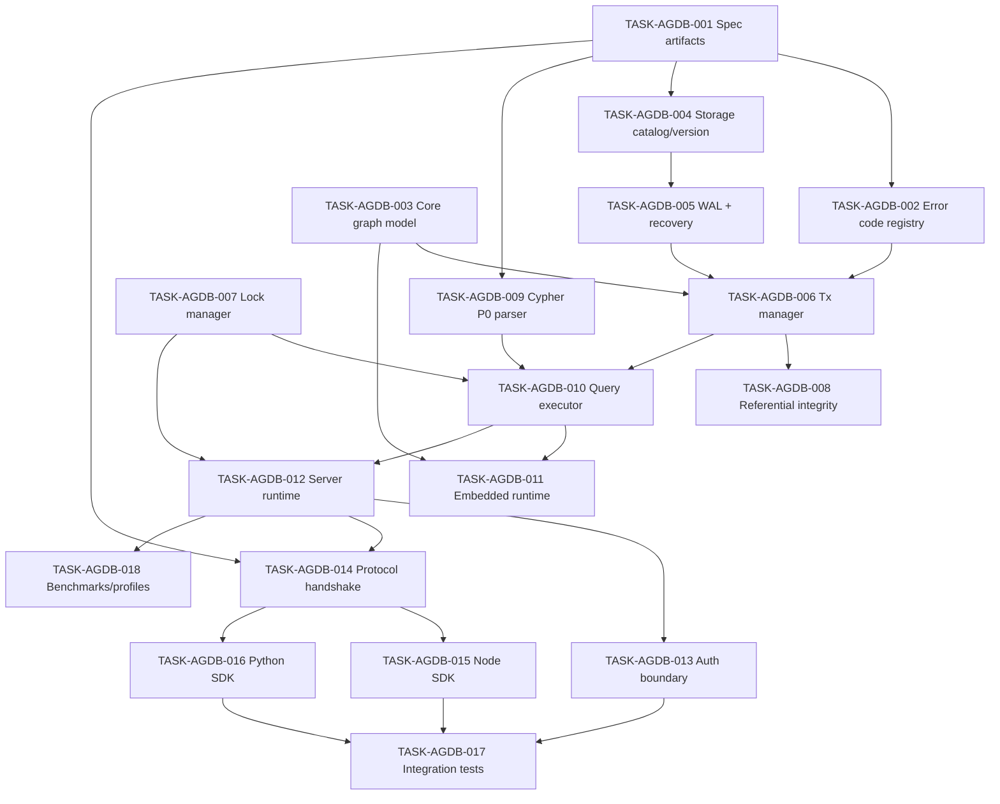
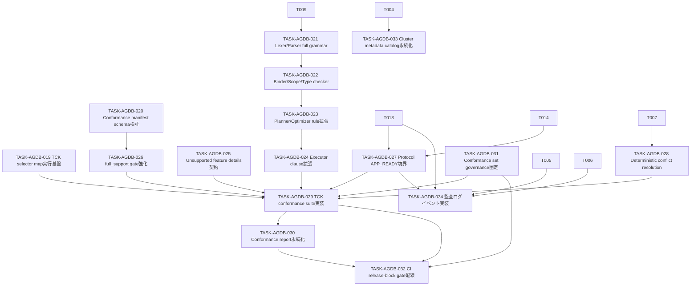
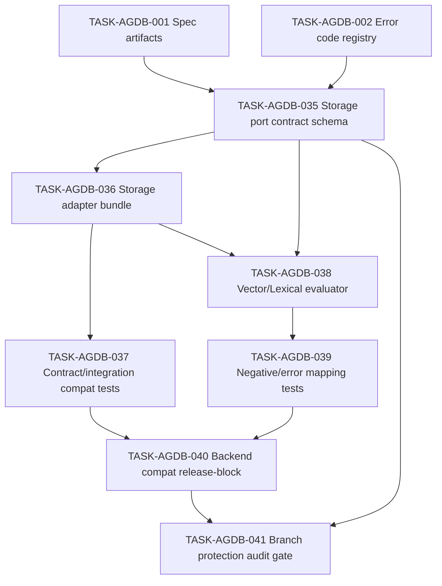
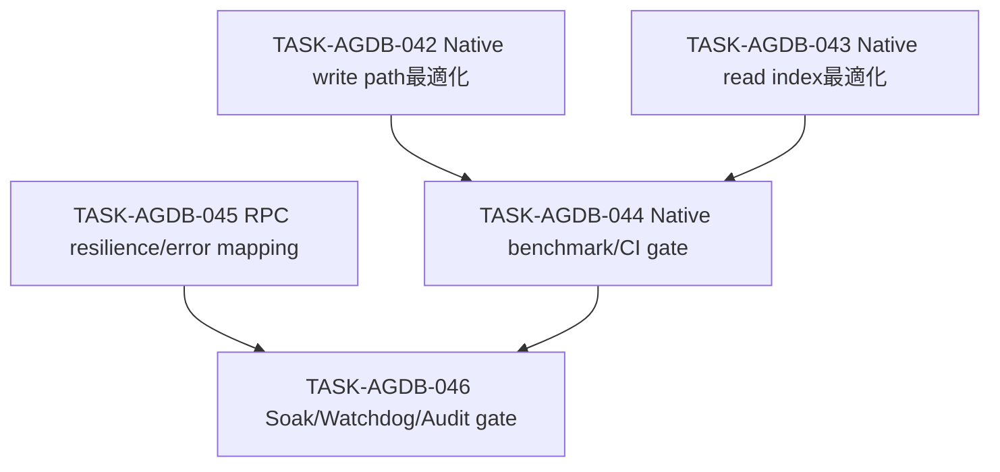

# PLAN-AIRA-GRAPHDB-001: aira-graphdb タスク分解（Phase 3）

| フィールド | 値 |
|-----------|---|
| **ID** | PLAN-AIRA-GRAPHDB-001 |
| **バージョン** | 1.2 |
| **ステータス** | Draft |
| **作成日** | 2026-06-20 |
| **更新日** | 2026-06-21 |
| **要件参照** | `REQ-AIRA-GRAPHDB-001` |
| **設計参照** | `DES-AIRA-GRAPHDB-001` |

## 1. 実行順序（DAG）

## 2. タスク一覧

### TASK-AGDB-001: 不変仕様アーティファクト固定

**トレーサビリティ**: REQ-AGDB-004, REQ-AGDB-005, REQ-AGDB-016 → DES-AGDB-003  
**パッケージ**: `packages/aira-graphdb`  
**種別**: backend  
**優先度**: P0  
**依存**: なし  
**見積**: 2h

**実装内容**:
- `AGDB-TYPEMAP-P0@1.0.0` を仕様ファイル化
- `AGDB-CYPHER-P0-GRAMMAR@1.0.0` を仕様ファイル化
- `AGDB-ERROR-CODES@1.0.0` を仕様ファイル化

**受入基準**:
- [ ] テストが書かれている（Red）
- [ ] テストが通る（Green）
- [ ] リファクタリング済み（Blue）

---

### TASK-AGDB-002: エラーコードレジストリ実装

**トレーサビリティ**: REQ-AGDB-006, REQ-AGDB-016 → DES-AGDB-003  
**パッケージ**: `packages/aira-graphdb`  
**種別**: backend  
**優先度**: P0  
**依存**: TASK-AGDB-001  
**見積**: 1.5h

**実装内容**:
- エラーコード enum と変換表を実装
- protocol/query/auth/tx/storage で共通利用できるAPIを実装

**受入基準**:
- [ ] テストが書かれている（Red）
- [ ] テストが通る（Green）
- [ ] リファクタリング済み（Blue）

---

### TASK-AGDB-003: Graphドメインモデル実装

**トレーサビリティ**: REQ-AGDB-001 → DES-AGDB-001  
**パッケージ**: `packages/aira-graphdb`  
**種別**: backend  
**優先度**: P0  
**依存**: なし  
**見積**: 2h

**実装内容**:
- Node/Edge/Property モデルとID生成を実装
- CRUD基盤のインメモリ実装を作成

**受入基準**:
- [ ] テストが書かれている（Red）
- [ ] テストが通る（Green）
- [ ] リファクタリング済み（Blue）

---

### TASK-AGDB-004: Storage catalog/version管理

**トレーサビリティ**: REQ-AGDB-014 → DES-AGDB-001  
**パッケージ**: `packages/aira-graphdb`  
**種別**: backend  
**優先度**: P0  
**依存**: TASK-AGDB-001  
**見積**: 1.5h

**実装内容**:
- catalog schema version を実装
- 非互換時 `INCOMPATIBLE_FORMAT` を返す判定処理を実装

**受入基準**:
- [ ] テストが書かれている（Red）
- [ ] テストが通る（Green）
- [ ] リファクタリング済み（Blue）

---

### TASK-AGDB-005: WAL書込みと復旧

**トレーサビリティ**: REQ-AGDB-007, REQ-AGDB-008 → DES-AGDB-001  
**パッケージ**: `packages/aira-graphdb`  
**種別**: backend  
**優先度**: P0  
**依存**: TASK-AGDB-004  
**見積**: 2h

**実装内容**:
- WAL append/flush 実装
- recovery replay と整合性検証を実装

**受入基準**:
- [ ] テストが書かれている（Red）
- [ ] テストが通る（Green）
- [ ] リファクタリング済み（Blue）

---

### TASK-AGDB-006: トランザクションマネージャ

**トレーサビリティ**: REQ-AGDB-007, REQ-AGDB-010, REQ-AGDB-011 → DES-AGDB-001, DES-AGDB-005  
**パッケージ**: `packages/aira-graphdb`  
**種別**: backend  
**優先度**: P0  
**依存**: TASK-AGDB-002, TASK-AGDB-003, TASK-AGDB-005  
**見積**: 2h

**実装内容**:
- begin/commit/rollback API
- commit時 stable storage 後 ACK の保証
- rollback無副作用を実装

**受入基準**:
- [ ] テストが書かれている（Red）
- [ ] テストが通る（Green）
- [ ] リファクタリング済み（Blue）

---

### TASK-AGDB-007: 排他ロックマネージャ

**トレーサビリティ**: REQ-AGDB-013, REQ-AGDB-011 → DES-AGDB-002, DES-AGDB-004  
**パッケージ**: `packages/aira-graphdb`  
**種別**: backend  
**優先度**: P0  
**依存**: TASK-AGDB-006  
**見積**: 1.5h

**実装内容**:
- 同一DBファイルへの writer 排他制御
- 競合時 `WRITE_LOCK_CONFLICT` / `RETRYABLE_CONFLICT` を返す

**受入基準**:
- [ ] テストが書かれている（Red）
- [ ] テストが通る（Green）
- [ ] リファクタリング済み（Blue）

---

### TASK-AGDB-008: 参照整合性ガード

**トレーサビリティ**: REQ-AGDB-012 → DES-AGDB-005  
**パッケージ**: `packages/aira-graphdb`  
**種別**: backend  
**優先度**: P0  
**依存**: TASK-AGDB-006  
**見積**: 1.5h

**実装内容**:
- エッジ作成/更新時のノード存在検証
- `DETACH DELETE` / `REFERENTIAL_INTEGRITY_VIOLATION` 処理を実装

**受入基準**:
- [ ] テストが書かれている（Red）
- [ ] テストが通る（Green）
- [ ] リファクタリング済み（Blue）

---

### TASK-AGDB-009: Cypher P0 パーサ/バリデータ

**トレーサビリティ**: REQ-AGDB-005, REQ-AGDB-006 → DES-AGDB-004  
**パッケージ**: `packages/aira-graphdb`  
**種別**: backend  
**優先度**: P0  
**依存**: TASK-AGDB-001  
**見積**: 2h

**実装内容**:
- `AGDB-CYPHER-P0-GRAMMAR@1.0.0` 準拠パーサを実装
- 未対応句の拒否と `UNSUPPORTED_FEATURE` を実装

**受入基準**:
- [ ] テストが書かれている（Red）
- [ ] テストが通る（Green）
- [ ] リファクタリング済み（Blue）
- [ ] P95 が 50ms 超過時に CI を fail し、release をブロックする

---

### TASK-AGDB-010: Query Executor

**トレーサビリティ**: REQ-AGDB-001, REQ-AGDB-005, REQ-AGDB-006, REQ-AGDB-012 → DES-AGDB-001, DES-AGDB-003, DES-AGDB-004  
**パッケージ**: `packages/aira-graphdb`  
**種別**: backend  
**優先度**: P0  
**依存**: TASK-AGDB-006, TASK-AGDB-007, TASK-AGDB-008, TASK-AGDB-009  
**見積**: 2h

**実装内容**:
- MATCH/WHERE/RETURN/CREATE/MERGE/DELETE/SET 実行器を実装
- read/write 決定性要件を満たす評価順序を実装

**受入基準**:
- [ ] テストが書かれている（Red）
- [ ] テストが通る（Green）
- [ ] リファクタリング済み（Blue）

---

### TASK-AGDB-011: Embedded Runtime

**トレーサビリティ**: REQ-AGDB-002, REQ-AGDB-001 → DES-AGDB-002  
**パッケージ**: `packages/aira-graphdb`  
**種別**: backend  
**優先度**: P0  
**依存**: TASK-AGDB-003, TASK-AGDB-010  
**見積**: 1.5h

**実装内容**:
- in-process API を公開
- file path open と lifecycle 管理を実装

**受入基準**:
- [ ] テストが書かれている（Red）
- [ ] テストが通る（Green）
- [ ] リファクタリング済み（Blue）

---

### TASK-AGDB-012: Server Runtime

**トレーサビリティ**: REQ-AGDB-003, REQ-AGDB-013 → DES-AGDB-002  
**パッケージ**: `packages/aira-graphdb`  
**種別**: api  
**優先度**: P0  
**依存**: TASK-AGDB-007, TASK-AGDB-010  
**見積**: 2h

**実装内容**:
- TCP サーバー起動/接続セッション管理を実装
- `P0-SERVER-CONCURRENCY` 32接続プロファイルを実装

**受入基準**:
- [ ] テストが書かれている（Red）
- [ ] テストが通る（Green）
- [ ] リファクタリング済み（Blue）

---

### TASK-AGDB-013: 認証・TLS 境界

**トレーサビリティ**: REQ-AGDB-015 → DES-AGDB-005  
**パッケージ**: `packages/aira-graphdb`  
**種別**: security  
**優先度**: P0  
**依存**: TASK-AGDB-012  
**見積**: 2h

**実装内容**:
- TLS1.3 強制
- JWT 署名検証（JWKS/公開鍵）+ claim 検証
- `alg` 許可リスト、`alg=none` 拒否、`kid` 一意解決検証を実装

**受入基準**:
- [ ] テストが書かれている（Red）
- [ ] テストが通る（Green）
- [ ] リファクタリング済み（Blue）

---

### TASK-AGDB-014: Protocol Handshake 層

**トレーサビリティ**: REQ-AGDB-004, REQ-AGDB-016 → DES-AGDB-003  
**パッケージ**: `packages/aira-graphdb`  
**種別**: api  
**優先度**: P0  
**依存**: TASK-AGDB-001, TASK-AGDB-012  
**見積**: 1.5h

**実装内容**:
- `protocol_version` / `canonical_type_system_version` negotiation
- 不一致時 `PROTOCOL_VERSION_MISMATCH` を実装

**受入基準**:
- [ ] テストが書かれている（Red）
- [ ] テストが通る（Green）
- [ ] リファクタリング済み（Blue）

---

### TASK-AGDB-015: Node SDK P0

**トレーサビリティ**: REQ-AGDB-009, REQ-AGDB-004, REQ-AGDB-016 → DES-AGDB-003  
**パッケージ**: `sdk/node`  
**種別**: api  
**優先度**: P0  
**依存**: TASK-AGDB-014  
**見積**: 2h

**実装内容**:
- 接続/CRUD/クエリ/tx API を実装
- `AGDB-TYPEMAP-P0@1.0.0` に準拠した型変換を実装

**受入基準**:
- [ ] テストが書かれている（Red）
- [ ] テストが通る（Green）
- [ ] リファクタリング済み（Blue）

---

### TASK-AGDB-016: Python SDK P0

**トレーサビリティ**: REQ-AGDB-009, REQ-AGDB-004, REQ-AGDB-016 → DES-AGDB-003  
**パッケージ**: `sdk/python`  
**種別**: api  
**優先度**: P0  
**依存**: TASK-AGDB-014  
**見積**: 2h

**実装内容**:
- 接続/CRUD/クエリ/tx API を実装
- `AGDB-TYPEMAP-P0@1.0.0` に準拠した型変換を実装

**受入基準**:
- [ ] テストが書かれている（Red）
- [ ] テストが通る（Green）
- [ ] リファクタリング済み（Blue）

---

### TASK-AGDB-017: 統合テストスイート

**トレーサビリティ**: REQ-AGDB-001〜016 全体 → DES-AGDB-001〜005  
**パッケージ**: `packages/aira-graphdb/tests`, `sdk/*/tests`  
**種別**: test  
**優先度**: P0  
**依存**: TASK-AGDB-013, TASK-AGDB-015, TASK-AGDB-016  
**見積**: 2h

**実装内容**:
- embedded/server 同等性テスト
- SDK間同等性テスト
- auth/protocol/error code 回帰テスト

**受入基準**:
- [ ] テストが書かれている（Red）
- [ ] テストが通る（Green）
- [ ] リファクタリング済み（Blue）

---

### TASK-AGDB-018: 性能プロファイル・ベンチマーク

**トレーサビリティ**: REQ-AGDB-NF-001, REQ-AGDB-003 → DES-AGDB-002, DES-AGDB-007  
**パッケージ**: `packages/aira-graphdb/bench`  
**種別**: test  
**優先度**: P1  
**依存**: TASK-AGDB-012  
**見積**: 1.5h

**実装内容**:
- `P0-LATENCY-BASELINE` 計測スクリプトを実装
- `P0-SERVER-CONCURRENCY` 計測スクリプトを実装
- レポート出力を実装

**受入基準**:
- [ ] テストが書かれている（Red）
- [ ] テストが通る（Green）
- [ ] リファクタリング済み（Blue）

## 3. カバレッジチェック

### REQ カバレッジ（100%）

| REQ | 対応TASK |
|---|---|
| REQ-AGDB-001 | TASK-AGDB-003, 010, 011, 017 |
| REQ-AGDB-002 | TASK-AGDB-011 |
| REQ-AGDB-003 | TASK-AGDB-012, 018 |
| REQ-AGDB-004 | TASK-AGDB-001, 014, 015, 016 |
| REQ-AGDB-005 | TASK-AGDB-001, 009, 010 |
| REQ-AGDB-006 | TASK-AGDB-002, 009, 010 |
| REQ-AGDB-007 | TASK-AGDB-005, 006 |
| REQ-AGDB-008 | TASK-AGDB-005, 034 |
| REQ-AGDB-009 | TASK-AGDB-015, 016 |
| REQ-AGDB-010 | TASK-AGDB-006, 034 |
| REQ-AGDB-011 | TASK-AGDB-006, 007 |
| REQ-AGDB-012 | TASK-AGDB-008, 010, 034 |
| REQ-AGDB-013 | TASK-AGDB-007, 012 |
| REQ-AGDB-014 | TASK-AGDB-004 |
| REQ-AGDB-015 | TASK-AGDB-013, 017, 027, 034 |
| REQ-AGDB-016 | TASK-AGDB-001, 002, 014, 015, 016 |
| REQ-AGDB-019 | TASK-AGDB-035, 036, 037 |
| REQ-AGDB-020 | TASK-AGDB-038, 039 |
| REQ-AGDB-021 | TASK-AGDB-040, 041 |
| REQ-AGDB-NF-001 | TASK-AGDB-018 |
| REQ-AGDB-NF-002 | TASK-AGDB-033 |

### DES カバレッジ（100%）

| DES | 対応TASK |
|---|---|
| DES-AGDB-001 | TASK-AGDB-003, 004, 005, 006 |
| DES-AGDB-002 | TASK-AGDB-007, 011, 012, 018 |
| DES-AGDB-003 | TASK-AGDB-001, 002, 014, 015, 016, 025, 027 |
| DES-AGDB-004 | TASK-AGDB-009, 010, 021, 022, 023, 024, 025 |
| DES-AGDB-005 | TASK-AGDB-006, 008, 013, 027, 028, 034 |
| DES-AGDB-006 | TASK-AGDB-019, 020, 026, 029, 030, 031, 032 |
| DES-AGDB-007 | TASK-AGDB-018 |
| DES-AGDB-008 | TASK-AGDB-033 |
| DES-AGDB-009 | TASK-AGDB-035, 036, 037 |
| DES-AGDB-010 | TASK-AGDB-038, 039 |
| DES-AGDB-011 | TASK-AGDB-040, 041 |

## 4. Phase 3 品質ゲート結果（再検証中）

- [ ] REQ カバレッジ 100%
- [ ] DES カバレッジ 100%
- [ ] 依存関係 DAG（循環依存なし）
- [ ] 全タスク 2時間以内
- [ ] 全タスクに Red→Green→Blue 受入基準あり

## 5. Phase 4 進捗（自動ループ実行）

- [x] TASK-AGDB-001: 不変仕様アーティファクト固定
- [x] TASK-AGDB-002: エラーコードレジストリ実装
- [x] TASK-AGDB-003: Graphドメインモデル実装
- [x] TASK-AGDB-004: Storage catalog/version管理
- [x] TASK-AGDB-005: WAL書込みと復旧
- [x] TASK-AGDB-006: トランザクションマネージャ
- [x] TASK-AGDB-007: 排他ロックマネージャ
- [x] TASK-AGDB-008: 参照整合性ガード
- [x] TASK-AGDB-009: Cypher P0 パーサ/バリデータ（最小）
- [x] TASK-AGDB-010: Query Executor（最小）
- [x] TASK-AGDB-011: Embedded Runtime（最小）
- [x] TASK-AGDB-012: Server Runtime（最小）
- [x] TASK-AGDB-013: 認証・TLS境界（検証ロジック）
- [x] TASK-AGDB-014: Protocol Handshake層
- [x] TASK-AGDB-015: Node SDK P0（最小）
- [x] TASK-AGDB-016: Python SDK P0（最小）
- [x] TASK-AGDB-017: 統合テストスイート（初版）
- [x] TASK-AGDB-018: ベンチマーク/プロファイル（初版）

## 6. Phase 3 追加タスク分解（openCypher 9 フル対応差分）

### 6.1 実行順序（DAG / Delta）

### 6.2 タスク一覧（Delta）

### TASK-AGDB-019: TCK selector map 実行基盤

**トレーサビリティ**: REQ-AGDB-017, REQ-AGDB-018 → DES-AGDB-006  
**パッケージ**: `spec/conformance`, `tests`  
**種別**: test  
**優先度**: P0  
**依存**: なし  
**見積**: 1.5h

**実装内容**:
- `tck_selector_map` の ID→selector 一意解決ローダを実装
- 未解決ID時 fail-fast を実装

**受入基準**:
- [ ] テストが書かれている（Red）
- [ ] テストが通る（Green）
- [ ] リファクタリング済み（Blue）
- [ ] `tck_selector_map` の全 `tck_id` が一意 selector に解決され、未解決時は失敗する

---

### TASK-AGDB-020: Conformance manifest schema 検証

**トレーサビリティ**: REQ-AGDB-018 → DES-AGDB-006  
**パッケージ**: `spec/contracts`, `tests`  
**種別**: test  
**優先度**: P0  
**依存**: なし  
**見積**: 1.5h

**実装内容**:
- manifest の必須項目（`full_support`, `snapshot_ref`, `features.feature_id`）検証を実装
- `normative_feature_count` / `classified_normative_feature_count` 整合検証を実装

**受入基準**:
- [ ] テストが書かれている（Red）
- [ ] テストが通る（Green）
- [ ] リファクタリング済み（Blue）
- [ ] `full_support/snapshot_ref/features.feature_id` 欠落時に conformance gate が失敗する

---

### TASK-AGDB-021: openCypher 9 Lexer/Parser 拡張

**トレーサビリティ**: REQ-AGDB-005, REQ-AGDB-006 → DES-AGDB-004  
**パッケージ**: `src/query.rs`  
**種別**: backend  
**優先度**: P0  
**依存**: TASK-AGDB-009  
**見積**: 2h

**実装内容**:
- `OPTIONAL MATCH`, `WITH`, `UNWIND`, `REMOVE`, `SKIP/LIMIT` を文法対応
- 構文エラーを標準化エラーへ変換
- `MERGE` 構文（on-create/on-match）をパース可能にする

**受入基準**:
- [ ] テストが書かれている（Red）
- [ ] テストが通る（Green）
- [ ] リファクタリング済み（Blue）
- [ ] `OPTIONAL MATCH/WITH/UNWIND/MERGE/REMOVE/SKIP/LIMIT` が parser レベルで受理される

---

### TASK-AGDB-022: Binder/Scope/Type checker 実装

**トレーサビリティ**: REQ-AGDB-005 → DES-AGDB-004  
**パッケージ**: `src/query.rs`  
**種別**: backend  
**優先度**: P0  
**依存**: TASK-AGDB-021  
**見積**: 2h

**実装内容**:
- `WITH` のスコープ切替・別名解決を実装
- 規範式（property/comparison/boolean/list-map）検証を実装

**受入基準**:
- [ ] テストが書かれている（Red）
- [ ] テストが通る（Green）
- [ ] リファクタリング済み（Blue）
- [ ] `WITH` の別名/スコープ違反時に標準化エラーを返す

---

### TASK-AGDB-023: Planner/Optimizer rule 拡張

**トレーサビリティ**: REQ-AGDB-005 → DES-AGDB-004  
**パッケージ**: `src/query.rs`  
**種別**: backend  
**優先度**: P0  
**依存**: TASK-AGDB-022  
**見積**: 1.5h

**実装内容**:
- clause 評価順序を openCypher 9 準拠で固定
- `ORDER BY` 有無で同値判定戦略を分岐

**受入基準**:
- [ ] テストが書かれている（Red）
- [ ] テストが通る（Green）
- [ ] リファクタリング済み（Blue）
- [ ] `ORDER BY` 有無で行比較戦略（ordered / multiset）が切り替わる

---

### TASK-AGDB-024: Executor clause 拡張

**トレーサビリティ**: REQ-AGDB-005, REQ-AGDB-012 → DES-AGDB-004, DES-AGDB-005  
**パッケージ**: `src/query.rs`, `src/graph.rs`  
**種別**: backend  
**優先度**: P0  
**依存**: TASK-AGDB-023  
**見積**: 2h

**実装内容**:
- `OPTIONAL MATCH`, `UNWIND`, aggregation, `REMOVE` 実行器を実装
- edge create/update の存在検証を統合
- `MERGE` の on-create / on-match セマンティクスを実装

**受入基準**:
- [ ] テストが書かれている（Red）
- [ ] テストが通る（Green）
- [ ] リファクタリング済み（Blue）
- [ ] `MERGE` の on-create / on-match が期待どおり分岐し、同一初期状態で同一最終状態になる

---

### TASK-AGDB-025: Unsupported feature details 契約実装

**トレーサビリティ**: REQ-AGDB-006, REQ-AGDB-016 → DES-AGDB-003, DES-AGDB-004  
**パッケージ**: `src/errors.rs`, `src/query.rs`  
**種別**: backend  
**優先度**: P0  
**依存**: TASK-AGDB-024  
**見積**: 1.5h

**実装内容**:
- `UNSUPPORTED_FEATURE` 時に `details.unsupported_clause` を必須設定
- SDK/Server で同一payload契約を返す

**受入基準**:
- [ ] テストが書かれている（Red）
- [ ] テストが通る（Green）
- [ ] リファクタリング済み（Blue）
- [ ] `UNSUPPORTED_FEATURE` の payload に `details.unsupported_clause` が必ず含まれる

---

### TASK-AGDB-026: full_support gate 強化

**トレーサビリティ**: REQ-AGDB-018 → DES-AGDB-006  
**パッケージ**: `tests`, `spec/contracts`  
**種別**: test  
**優先度**: P0  
**依存**: TASK-AGDB-020  
**見積**: 1.5h

**実装内容**:
- 規範機能が non-required の場合 fail する negative ケースを実装
- upstream total/hash mismatch で fail するケースを実装

**受入基準**:
- [ ] テストが書かれている（Red）
- [ ] テストが通る（Green）
- [ ] リファクタリング済み（Blue）
- [ ] 規範機能を non-required に改変した場合、release gate が失敗する

---

### TASK-AGDB-027: Protocol APP_READY 境界実装

**トレーサビリティ**: REQ-AGDB-015 → DES-AGDB-003  
**パッケージ**: `src/server.rs`, `src/auth.rs`  
**種別**: security  
**優先度**: P0  
**依存**: TASK-AGDB-013, TASK-AGDB-014  
**見積**: 1.5h

**実装内容**:
- `CONNECTED -> TLS_OK -> AUTH_OK -> APP_READY` 状態遷移を実装
- `APP_READY` 前のアプリ要求拒否を実装

**受入基準**:
- [ ] テストが書かれている（Red）
- [ ] テストが通る（Green）
- [ ] リファクタリング済み（Blue）
- [ ] `APP_READY` 前の全アプリ要求（query/tx/command）が拒否される

---

### TASK-AGDB-028: 決定的競合解決実装

**トレーサビリティ**: REQ-AGDB-011 → DES-AGDB-005  
**パッケージ**: `src/tx.rs`, `src/lock.rs`  
**種別**: backend  
**優先度**: P0  
**依存**: TASK-AGDB-007  
**見積**: 1.5h

**実装内容**:
- lock 取得順序 + txId タイブレーク規則を実装
- 同一スケジュール再実行で同一終了結果を保証

**受入基準**:
- [ ] テストが書かれている（Red）
- [ ] テストが通る（Green）
- [ ] リファクタリング済み（Blue）
- [ ] 同一競合シナリオを同一スケジュールで再実行して同一終了結果となる

---

### TASK-AGDB-029: openCypher 9 TCK 実行スイート

**トレーサビリティ**: REQ-AGDB-017, REQ-AGDB-018 → DES-AGDB-006  
**パッケージ**: `tests/cypher_conformance.rs`  
**種別**: test  
**優先度**: P0  
**依存**: TASK-AGDB-019, TASK-AGDB-024, TASK-AGDB-025, TASK-AGDB-026, TASK-AGDB-027, TASK-AGDB-028, TASK-AGDB-031  
**見積**: 2h

**実装内容**:
- `required_tck_ids` の 1:1 実行を実装
- `required_tests` の `covers_req` / `covers_acceptance` 検証を実装

**受入基準**:
- [ ] テストが書かれている（Red）
- [ ] テストが通る（Green）
- [ ] リファクタリング済み（Blue）
- [ ] `required_tck_ids` 全件が 1:1 実行され、1件でも失敗時は suite 全体を失敗させる

---

### TASK-AGDB-030: Compatibility report 永続化

**トレーサビリティ**: REQ-AGDB-017 → DES-AGDB-006  
**パッケージ**: `tests`, `docs`  
**種別**: test  
**優先度**: P0  
**依存**: TASK-AGDB-029  
**見積**: 1.5h

**実装内容**:
- clause/feature 別 PASS/FAIL レポートを保存
- CI artifact として保存/比較可能にする

**受入基準**:
- [ ] テストが書かれている（Red）
- [ ] テストが通る（Green）
- [ ] リファクタリング済み（Blue）
- [ ] clause/feature 別 PASS/FAIL と failed test IDs が artifact として保存される

---

### TASK-AGDB-031: Conformance set governance 固定

**トレーサビリティ**: REQ-AGDB-017, REQ-AGDB-018 → DES-AGDB-006  
**パッケージ**: `spec/conformance`, `spec/contracts`  
**種別**: infra  
**優先度**: P0  
**依存**: TASK-AGDB-019, TASK-AGDB-020  
**見積**: 1.5h

**実装内容**:
- `opencypher9-required-tests.yaml` の mandatory negative-case ID 存在チェックを実装
- `snapshot_ref` が commit SHA 以外の場合 fail する governance check を実装

**受入基準**:
- [ ] テストが書かれている（Red）
- [ ] テストが通る（Green）
- [ ] リファクタリング済み（Blue）
- [ ] mandatory negative-case 欠落時に release gate が失敗する

---

### TASK-AGDB-032: CI release-block gate 配線

**トレーサビリティ**: REQ-AGDB-017, REQ-AGDB-018 → DES-AGDB-006  
**パッケージ**: `.github/workflows`, `tests`  
**種別**: infra  
**優先度**: P0  
**依存**: TASK-AGDB-029, TASK-AGDB-030, TASK-AGDB-031  
**見積**: 1.5h

**実装内容**:
- conformance suite を required check として CI に配線
- `passRate==100`、未解決IDなし、mandatory negative-case充足を release-block 条件に設定

**受入基準**:
- [ ] テストが書かれている（Red）
- [ ] テストが通る（Green）
- [ ] リファクタリング済み（Blue）
- [ ] conformance 失敗時に release がブロックされる

---

### TASK-AGDB-033: Cluster metadata catalog 永続化

**トレーサビリティ**: REQ-AGDB-NF-002 → DES-AGDB-008  
**パッケージ**: `src/storage.rs`, `src/runtime.rs`  
**種別**: backend  
**優先度**: P1  
**依存**: TASK-AGDB-004  
**見積**: 2h

**実装内容**:
- system catalog に `partitions` / `replicas` メタデータ永続化を実装
- catalog schema version との整合検証を実装

**受入基準**:
- [ ] テストが書かれている（Red）
- [ ] テストが通る（Green）
- [ ] リファクタリング済み（Blue）
- [ ] catalog から partition/replica 情報を再起動後に再読込できる

---

### TASK-AGDB-034: 監査ログイベント実装

**トレーサビリティ**: REQ-AGDB-008, REQ-AGDB-010, REQ-AGDB-012, REQ-AGDB-015 → DES-AGDB-001, DES-AGDB-003, DES-AGDB-005  
**パッケージ**: `src/storage.rs`, `src/tx.rs`, `src/auth.rs`, `src/server.rs`  
**種別**: security  
**優先度**: P0  
**依存**: TASK-AGDB-005, TASK-AGDB-006, TASK-AGDB-013, TASK-AGDB-027  
**見積**: 2h

**実装内容**:
- 整合性違反、rollback、参照整合性違反、認証失敗、未認証要求拒否（AUTH_REQUIRED）イベントの監査ログ出力を実装
- イベント種別と必須payloadフィールドを固定

**受入基準**:
- [ ] テストが書かれている（Red）
- [ ] テストが通る（Green）
- [ ] リファクタリング済み（Blue）
- [ ] 5種別イベントが期待payloadで記録される
- [ ] AUTH_REQUIRED 拒否イベントが期待payloadで記録される

## 7. Delta カバレッジ（REQ 17/18 + 主要強化）

| REQ | 対応TASK (Delta) |
|---|---|
| REQ-AGDB-005 | TASK-AGDB-021, 022, 023, 024 |
| REQ-AGDB-006 | TASK-AGDB-024, 025, 029, 031 |
| REQ-AGDB-011 | TASK-AGDB-028 |
| REQ-AGDB-015 | TASK-AGDB-027 |
| REQ-AGDB-017 | TASK-AGDB-019, 029, 030, 032 |
| REQ-AGDB-018 | TASK-AGDB-020, 026, 029, 031, 032 |
| REQ-AGDB-NF-001 | TASK-AGDB-018 |
| REQ-AGDB-NF-002 | TASK-AGDB-033 |
| REQ-AGDB-NF-003 | TASK-AGDB-042, 044 |
| REQ-AGDB-NF-004 | TASK-AGDB-043, 044 |
| REQ-AGDB-NF-005 | TASK-AGDB-045, 046 |

## 8. Phase 4 追加タスク進捗（openCypher 9 フル対応）

- [x] TASK-AGDB-019: TCK selector map実行基盤
- [x] TASK-AGDB-020: Conformance manifest schema検証
- [x] TASK-AGDB-021: Lexer/Parser full grammar
- [x] TASK-AGDB-022: Binder/Scope/Type checker
- [x] TASK-AGDB-023: Planner/Optimizer rule拡張
- [x] TASK-AGDB-024: Executor clause拡張
- [x] TASK-AGDB-025: Unsupported feature details契約
- [x] TASK-AGDB-026: full_support gate強化
- [x] TASK-AGDB-027: Protocol APP_READY境界
- [x] TASK-AGDB-028: Deterministic conflict resolution
- [x] TASK-AGDB-029: TCK conformance suite実装
- [x] TASK-AGDB-030: Conformance report永続化
- [x] TASK-AGDB-031: Conformance set governance固定
- [x] TASK-AGDB-032: CI release-block gate配線
- [x] TASK-AGDB-033: Cluster metadata catalog永続化
- [x] TASK-AGDB-034: 監査ログイベント実装

## 9. Phase 3 追加タスク分解（aira-synapse backend 互換）

### 9.1 実行順序（DAG / Compat Delta）

**前提**: TASK-AGDB-001（不変仕様アーティファクト固定）と TASK-AGDB-002（エラーコードレジストリ実装）が完了済みであること。

### 9.2 タスク一覧（Compat Delta）

### TASK-AGDB-035: Storage port契約のschema固定

**トレーサビリティ**: REQ-AGDB-019 → DES-AGDB-009  
**パッケージ**: `nahisaho/aira-graphdb:spec/contracts`  
**種別**: infra  
**優先度**: P0  
**依存**: TASK-AGDB-001, TASK-AGDB-002  
**見積**: 1.5h

**実装内容**:
- `aira-synapse-storage-ports.v1.0.0.json` の method-level request/response/error schema を固定
- `AGDB-ERROR-CODES@1.0.0` との参照整合チェックを実装
- `baseline-compat-fixture.v1.0.0.json` を契約資産として固定し、vector/lexical比較の正規化規則を定義
- 5ポート正準一覧（`IGraphStore/IVectorIndex/IMemoryStore/IGraphProjection/ILexicalRetriever`）を契約ファイルに固定

**受入基準**:
- [ ] テストが書かれている（Red）
- [ ] テストが通る（Green）
- [ ] リファクタリング済み（Blue）
- [ ] `aira-synapse` 側の実インターフェース定義（AST抽出）と `aira-synapse-storage-ports.v1.0.0.json` の双方向比較で対象漏れ 0 件を検証する
- [ ] 5ポート正準一覧（`IGraphStore/IVectorIndex/IMemoryStore/IGraphProjection/ILexicalRetriever`）の一致を検証する
- [ ] 5ポート全メソッドで schema-level 契約検証が 100% PASS する
- [ ] `baseline-compat-fixture.v1.0.0.json` が存在し、`comparisonRules.vector.normalization` を含む
- [ ] `baseline-compat-fixture.v1.0.0.json` が `dataset.sha256`、`normalization.scoreRoundingDecimals`、`normalization.thresholdEpsilon`、固定 seed/index parameter を含む
- [ ] 自動列挙は parse/load 成功を必須とし、method count が 0 の場合は fail する

---

### 9.2A Native Read/Write 高速化・安定化タスク（Perf-Stability Delta）

#### 9.2A.1 実行順序（DAG / Perf-Stability Delta）

**依存注記**: `TASK-AGDB-046` は soak と perf gate を単一の最終品質ゲートで評価するため `TASK-AGDB-044` に依存する。

#### 9.2A.1.1 プロファイル固定定義

| Profile | Dataset / Request Mix | Concurrency | Warmup | Duration / Iteration | Hardware Baseline | Pass Criteria |
|---|---|---|---|---|---|---|
| `P0-NATIVE-READ` | 10万ノード・10万ベクトル、`get_node/get_adjacent/vector_search(topK=10)/lexical_search(topK=10)` を均等比率で実行 | 8 | 60s | 各API 10,000 req | `self-hosted perf-linux-x64`（固定8vCPU/32GB） | 3回実行の中央値で `get_node<=5ms`, `get_adjacent<=10ms`, `vector_search<=30ms`, `lexical_search<=30ms`（P95） |
| `P0-NATIVE-WRITE` | 総書込 10,000（`upsert_nodes/upsert_edges/vector_upsert` を 4:3:3）バッチ100、永続化有効 | 8 | 60s | 10,000 writes | `self-hosted perf-linux-x64`（固定8vCPU/32GB） | 3回実行の中央値で write API P95<=25ms かつ 10,000 writes<=8,000ms |
| `P0-NATIVE-SOAK` | read/write 混在（read 70% / write 30%） + 異常系注入（invalid json/unknown method/execution failure） | 8 | 300s | 24h | `staging-perf-linux-x64`（固定8vCPU/32GB） | crash count=0 かつ内部障害率<=0.1% |
| `P0-NATIVE-SOAK-SMOKE` | `P0-NATIVE-SOAK` と同一ミックス | 8 | 60s | 30min | `self-hosted perf-linux-x64`（固定8vCPU/32GB） | crash count=0 かつ内部障害率<=0.1% |

#### 9.2A.2 タスク一覧（Perf-Stability Delta）

### TASK-AGDB-042: Native write path 原子的永続化最適化

**トレーサビリティ**: REQ-AGDB-NF-003 → DES-AGDB-012  
**パッケージ**: `src/bin/aira-graphdb-native.rs`, `src/storage.rs`  
**種別**: backend  
**優先度**: P0  
**依存**: なし  
**見積**: 2h

**実装内容**:
- write path を `tempfile write -> file fsync -> atomic rename -> directory fsync` に統一
- `1 API request = 1 atomic unit` を実装し、ack 後の全反映/ack 前の無反映を保証
- 全量 pretty-print 書込みを差分永続化へ置換して write latency を削減

**受入基準**:
- [ ] テストが書かれている（Red）
- [ ] テストが通る（Green）
- [ ] リファクタリング済み（Blue）
- [ ] crash injection で ack 済み request は全反映、ack 前 request は無反映となる
- [ ] crash injection 後の再起動で永続データ整合性検証を実行し、JSON 破損 0 件を満たす
- [ ] `P0-NATIVE-WRITE` 条件下で write API P95 25ms 以下を達成する

---

### TASK-AGDB-043: Native read index/検索最適化

**トレーサビリティ**: REQ-AGDB-NF-004 → DES-AGDB-012  
**パッケージ**: `src/bin/aira-graphdb-native.rs`, `src/index.rs`  
**種別**: backend  
**優先度**: P0  
**依存**: なし  
**見積**: 2h

**実装内容**:
- node/edge adjacency/vector/lexical の read path をメモリ常駐 index 化
- `get_node/get_adjacent/vector_search(topK=10)/lexical_search(topK=10)` の hot path を最適化
- benchmark fixture（10万ノード/10万ベクトル）で劣化検知を追加

**受入基準**:
- [ ] テストが書かれている（Red）
- [ ] テストが通る（Green）
- [ ] リファクタリング済み（Blue）
- [ ] `P0-NATIVE-READ` 条件（10万ノード、10万ベクトル、concurrency=8、warmup=60s、各API 10,000 request、`topK=10`）で測定される
- [ ] `get_node<=5ms`, `get_adjacent<=10ms`, `vector_search<=30ms`, `lexical_search<=30ms` の P95 しきい値を満たす

---

### TASK-AGDB-044: Native perf benchmark と CI gate 実装

**トレーサビリティ**: REQ-AGDB-NF-003, REQ-AGDB-NF-004 → DES-AGDB-012  
**パッケージ**: `tests`, `.github/workflows`, `scripts`  
**種別**: infra  
**優先度**: P0  
**依存**: TASK-AGDB-042, TASK-AGDB-043  
**見積**: 1.5h

**実装内容**:
- `bench native-read` / `bench native-write` の統一レポート出力を実装
- threshold 超過時 fail する perf gate を CI に配線
- `artifacts/native-bench-report.json` を必須アーティファクトとして保存

**受入基準**:
- [ ] テストが書かれている（Red）
- [ ] テストが通る（Green）
- [ ] リファクタリング済み（Blue）
- [ ] `P0-NATIVE-WRITE` で `10,000 writes <= 8,000ms` を満たさない場合に CI が失敗する
- [ ] `P0-NATIVE-READ/WRITE` の P95 しきい値超過時に CI が失敗する
- [ ] perf gate は `self-hosted perf-linux-x64` で 3回実行し、中央値で判定する
- [ ] `native-bench-report.json` に baseline 比較（回帰率しきい値）を含める
- [ ] bench 結果アーティファクトが保存される

---

### TASK-AGDB-045: RPC resilience と error/failureClass 契約実装

**トレーサビリティ**: REQ-AGDB-NF-005 → DES-AGDB-013  
**パッケージ**: `src/bin/aira-graphdb-native.rs`, `src/errors.rs`, `tests`  
**種別**: backend  
**優先度**: P0  
**依存**: なし  
**見積**: 1.5h

**実装内容**:
- `INVALID_REQUEST_JSON/UNSUPPORTED_FEATURE/REQUEST_EXECUTION_FAILED` の固定写像を実装
- `failureClass` closed enum（`INTERNAL_BUG|IO_FAILURE|OOM|TIMEOUT|CLIENT_INPUT`）を実装
- 3異常系（invalid json/unknown method/execution failure）の契約テストを実装

**受入基準**:
- [ ] テストが書かれている（Red）
- [ ] テストが通る（Green）
- [ ] リファクタリング済み（Blue）
- [ ] 異常系リクエスト単位で sidecar は継続稼働し、固定エラーコードを返す
- [ ] `REQUEST_EXECUTION_FAILED` で `failureClass` が必須化される

---

### TASK-AGDB-046: Soak/Watchdog/Audit 品質ゲート実装

**トレーサビリティ**: REQ-AGDB-NF-005 → DES-AGDB-013  
**パッケージ**: `src/server.rs`, `src/audit.rs`, `tests`, `.github/workflows`  
**種別**: security  
**優先度**: P0  
**依存**: TASK-AGDB-045, TASK-AGDB-044  
**見積**: 2h

**実装内容**:
- 24h soak runner と watchdog crash detector を実装
- request異常イベント監査ログ（`errorCode/failureClass/requestId/timestamp`）を実装
- crash 監査ログ（`errorCode/timestamp/processExitCode/signal/lastRequestId/uptimeSec`）を実装

**受入基準**:
- [ ] テストが書かれている（Red）
- [ ] テストが通る（Green）
- [ ] リファクタリング済み（Blue）
- [ ] `pull_request` では `P0-NATIVE-SOAK-SMOKE`（30min）を必須とする
- [ ] `schedule/release` では `P0-NATIVE-SOAK`（24h）を必須とする
- [ ] `P0-NATIVE-SOAK` 24h で crash count 0 を満たす
- [ ] 内部障害率（分子: `INTERNAL_BUG|IO_FAILURE|OOM|TIMEOUT`、分母: 全リクエスト）0.1% 以下
- [ ] 監査ログ必須項目が全イベント種別で検証される

### TASK-AGDB-036: aira-synapse storage adapter bundle 実装

**トレーサビリティ**: REQ-AGDB-019 → DES-AGDB-009  
**パッケージ**: `nahisaho/aira-graphdb:src`（adapter core）, `nahisaho/aira-synapse:packages/memgraphrag`（backend wiring）  
**種別**: backend  
**優先度**: P0  
**依存**: TASK-AGDB-035  
**見積**: 2h

**実装内容**:
- 実装対象repoを `nahisaho/aira-graphdb`（adapter core）と `nahisaho/aira-synapse`（backend wiring）に明示固定する
- `IGraphStore/IVectorIndex/IMemoryStore/IGraphProjection/ILexicalRetriever` の adapter bundle を実装
- 例外を `AGDB-ERROR-CODES@1.0.0` へ写像する共通 error mapper を実装

**受入基準**:
- [ ] テストが書かれている（Red）
- [ ] テストが通る（Green）
- [ ] リファクタリング済み（Blue）
- [ ] `storageFactory`/設定解決で `backend=aira-graphdb` を選択できることを統合テストで検証し、PASS する
- [ ] `aira-synapse` 実インターフェースAST抽出の必須メソッド一覧に対し、adapter 単体テストの呼び出し経路 PASS 率が 100% である
- [ ] 失敗経路で `AGDB-ERROR-CODES@1.0.0` への写像一致率が 100% である
- [ ] 自動列挙の expected method count と実行対象 count が一致しない場合は fail する

---

### TASK-AGDB-037: storage-port 互換回帰テスト実装

**トレーサビリティ**: REQ-AGDB-019 → DES-AGDB-009  
**パッケージ**: `nahisaho/aira-synapse:packages/memgraphrag/tests/integration/storage-port-compat`, `nahisaho/aira-synapse:packages/memgraphrag/tests/contracts`  
**種別**: test  
**優先度**: P0  
**依存**: TASK-AGDB-036  
**見積**: 1.5h

**実装内容**:
- 実装対象repoを `nahisaho/aira-synapse`（test suite）に固定する
- `tests/contracts/aira_synapse_storage_ports_contract.spec.ts` を実装/更新
- `tests/integration/storage-port-compat/*.spec.ts` を実装/更新

**受入基準**:
- [ ] テストが書かれている（Red）
- [ ] テストが通る（Green）
- [ ] リファクタリング済み（Blue）
- [ ] contract test と integration test の PASS 率がいずれも 100% である
- [ ] `aira-synapse` 実インターフェースAST抽出と contract JSON の比較で、未対応メソッド数が 0 件である
- [ ] contract/integration テストの executed case count が canonical case count と一致しない場合は fail する

---

### TASK-AGDB-038: Vector/Lexical 互換評価器実装

**トレーサビリティ**: REQ-AGDB-020 → DES-AGDB-010  
**パッケージ**: `nahisaho/aira-graphdb:src`（evaluator）, `nahisaho/aira-synapse:packages/memgraphrag`（compat harness）  
**種別**: backend  
**優先度**: P0  
**依存**: TASK-AGDB-035, TASK-AGDB-036  
**見積**: 2h

**実装内容**:
- 実装対象repoを `nahisaho/aira-graphdb`（評価器本体）と `nahisaho/aira-synapse`（比較ハーネス）に明示固定する
- `upsert/search/deleteByDocument` の互換評価器を実装
- lexical 結果スキーマ（`documentId/text/score/memoryType`）と排序（score desc / tie documentId asc）を固定
- baseline backend（neo4j）比較で `matchRate==1.0` 条件を実装

**受入基準**:
- [ ] テストが書かれている（Red）
- [ ] テストが通る（Green）
- [ ] リファクタリング済み（Blue）
- [ ] `upsert/search/deleteByDocument` の3操作が互換テストで検証される
- [ ] `corpusId/namespace` フィルタ保持テストが 100% PASS する
- [ ] 全文検索結果が `documentId/text/score/memoryType` スキーマ（`memoryType=passage|fact`）を満たす
- [ ] 全文検索結果が score 降順・同点時 documentId 昇順である
- [ ] `deleteByDocument` 後に対象 documentId の検索ヒットが 0 件になる
- [ ] baseline backend（neo4j）比較の `topK` 結果集合一致率が 100% である
- [ ] `threshold` 指定時は適用後集合で baseline と一致し、`matchRate==1.0` を満たす
- [ ] `baseline-compat-fixture.v1.0.0.json` の正規化規則（score丸め/threshold epsilon）で比較を実行する
- [ ] baseline 比較は固定 corpus snapshot hash・固定 seed・固定 index build parameter で再現可能に実行する
- [ ] exact-match 判定は deterministic index mode（契約で固定）でのみ実行する

---

### TASK-AGDB-039: 不正入力・固定エラーコード回帰テスト

**トレーサビリティ**: REQ-AGDB-020 → DES-AGDB-010  
**パッケージ**: `nahisaho/aira-synapse:packages/memgraphrag/tests/integration`  
**種別**: test  
**優先度**: P0  
**依存**: TASK-AGDB-038  
**見積**: 1.5h

**実装内容**:
- 実装対象repoを `nahisaho/aira-synapse`（negative test suite）に固定する
- `topK/threshold/corpusId/namespace` 不正入力の negative test を実装
- `INVALID_TOP_K/INVALID_THRESHOLD/INVALID_CORPUS_ID/INVALID_NAMESPACE` を固定で検証

**受入基準**:
- [ ] テストが書かれている（Red）
- [ ] テストが通る（Green）
- [ ] リファクタリング済み（Blue）
- [ ] 不正入力ケースで固定エラーコード一致率が 100% である

---

### TASK-AGDB-040: Backend compat release-block 実装

**トレーサビリティ**: REQ-AGDB-021 → DES-AGDB-011  
**パッケージ**: `nahisaho/aira-synapse:.github/workflows`, `nahisaho/aira-graphdb:spec/contracts`, `nahisaho/aira-synapse:packages/memgraphrag/tests/integration/backend-compat`  
**種別**: infra  
**優先度**: P0  
**依存**: TASK-AGDB-037, TASK-AGDB-039  
**見積**: 1.5h

**実装内容**:
- 実装対象repoを `nahisaho/aira-synapse`（workflow）と `nahisaho/aira-graphdb`（契約）に分離し、cross-repo 参照を固定
- `p0-compat-test-map.v1.0.0.json` の 1:1 mapping を gate 検証
- `backend-compat-failure-report.v1.0.0.json` 準拠の失敗レポート生成と検証を実装
- `backend-compat` job 失敗時に merge/release をブロック
- 実行トークンを `GITHUB_TOKEN`（workflow実行）+ `AIRA_GRAPHDB_CONTRACTS_READ_TOKEN`（`nahisaho/aira-graphdb` への `contents:read` のみ）に分離し、cross-repo契約参照を最小権限で実行する
- 実行モードを分離し、`requiredChecksByScope` を正準として `merge_group` では strict token gate、`pull_request`/`protected_branch_push` では read-only または非strictモードで実行する
- `storage-port-contract` / `storage-port-compat` の結果は `workflow_run` artifact として受け渡し、`backend-compat` 側で run-id 署名付きメタデータを検証する
- run-id 署名付きメタデータ検証は `artifact-attestation-policy.v1.0.0.json` を正準として実行する
- `AGDB-P0-UC-001..006` の正準定義は `p0-compat-test-map.v1.0.0.json` とし、ID↔testID 対応を同契約だけで判定する
- mode別判定表を固定する（trusted: artifact missing/stale=>fail, untrusted: artifact missing=>skip_with_reason=untrusted_event）
- strict context は protected commit SHA に直接紐づく単一経路（merge_queue 経由の reusable workflow）で emit し、SHA不一致を許可しない
- cross-repo契約参照の trust anchor を `cross-repo-contract-manifest.v1.0.0.json`（保護タグ + 署名付きmanifest）に固定する
- trust root は `cross-repo-contract-manifest.v1.0.0.json` の `keyId/keyFingerprint/allowedSigners` を正準として検証する

**受入基準**:
- [ ] テストが書かれている（Red）
- [ ] テストが通る（Green）
- [ ] リファクタリング済み（Blue）
- [ ] `AGDB-P0-UC-001..006` と互換テストIDの 1:1 対応で欠損数 0 を満たす
- [ ] backend routing/fallback（`sqlite|ladybug|neo4j|aira-graphdb`）の回帰テストを 100% PASS する
- [ ] baseline backend（neo4j）比較で成功/失敗判定・戻り値スキーマ・失敗時エラーコード一致率が 100% である
- [ ] 互換テスト失敗時に `errorCode` と `failedCompatibilityTestIds[]` を含むレポートを出力して CI を fail できる
- [ ] 失敗レポートの `errorCode` が `AGDB-ERROR-CODES@1.0.0` の定義集合に必ず含まれる
- [ ] `status="fail"` の失敗レポートが `backend-compat-failure-report.v1.0.0.json` に適合し、`failedCompatibilityTestIds.length >= 1` を満たす
- [ ] `nahisaho/aira-synapse` 側 workflow で gate が実行され、`nahisaho/aira-graphdb` 側契約参照で判定される
- [ ] trusted mode では `backend-compat` job が `storage-port-contract` と `storage-port-compat` の結果を依存入力として取り込み、いずれか失敗時に必ず fail する
- [ ] trusted mode（trusted branch/push）では依存artifactを `workflow_run` 経由で取得し、run-id/commit SHA/schema 一致がない場合は `missing_or_stale_dependency_artifact` で fail する
- [ ] strict mode（`merge_group`）では `AIRA_GRAPHDB_CONTRACTS_READ_TOKEN` の存在・最小権限を dry-run 検証し、欠落または権限不足時に `permission_missing:contracts_read` で明示 fail する
- [ ] baseline 比較は `baseline-compat-fixture.v1.0.0.json` の正規化規則を適用して評価する
- [ ] fork PR では strict token gate を要求せず、公開/pinned契約の read-only 検証モードで実行し、artifact 未取得時は required checks を `success` で完了し `output.summary` に `skip_with_reason=untrusted_event` を記録する。protected branch merge 前に strict モード再検証を必須とする
- [ ] `backend-compat-strict` required context は `requiredChecksByScope.merge_group` に従ってのみ success 可能であり、merge前に成功必須である
- [ ] `pull_request` と `protected_branch_push` では `backend-compat-strict` を required にせず、`merge_group` では required とする
- [ ] untrusted mode で参照する cross-repo 契約は immutable commit SHA + checksum 検証を必須とする
- [ ] untrusted mode では `AIRA_GRAPHDB_CONTRACTS_READ_TOKEN` をロード/参照せず、公開 pinned ref + checksum 検証のみで実行する
- [ ] strict context は protected commit SHA に紐づく check-run として emit され、SHA不一致時は `strict_sha_mismatch` で fail する
- [ ] cross-repo契約は `cross-repo-contract-manifest.v1.0.0.json` の署名検証と checksum 検証に成功しない限り利用しない
- [ ] cross-repo契約の署名検証は `keyId/keyFingerprint/allowedSigners` 一致を必須とし、不一致時は fail する

---

### TASK-AGDB-041: Required Check/branch protection 監査ゲート

**トレーサビリティ**: REQ-AGDB-021 → DES-AGDB-011  
**パッケージ**: `nahisaho/aira-graphdb:spec/contracts`, `nahisaho/aira-synapse:.github/workflows`  
**種別**: infra  
**優先度**: P0  
**依存**: TASK-AGDB-035, TASK-AGDB-040  
**見積**: 1h

**実装内容**:
- 実装対象repoを `nahisaho/aira-synapse`（branch protection監査）に固定し、`nahisaho/aira-graphdb` は契約定義の提供元とする
- `branch-protection-policy.v1.0.0.json` と GitHub branch protection の差分監査を実装
- スコープ別監査の正準データソースを `rulesets API + merge queue 設定 + check-run event metadata` に固定する
- `event-scope-map.v1.0.0.json` に `event_name + ref保護状態 + merge_queue有無` から scope への決定表を固定し、未該当は fail とする
- `branch-protection-policy.v1.0.0.json` に scope別 Required Checks（`pull_request`/`protected_branch_push` は strict 非required、`merge_group` は strict required）と canonical context 名を固定し、欠落時に governance gate を fail
- `branch-protection-policy.v1.0.0.json` の `requiredChecksDetailed`（context/workflow/job）を正準テーブルとし、実際のcheck-run名との一致を監査する
- `branch-protection-policy.v1.0.0.json` の `requiredChecksByScope`（`pull_request` / `merge_group` / `protected_branch_push`）を正準とし、スコープ別に required check を監査する
- `branch-protection-policy.v1.0.0.json` の `conclusionPolicy` を正準とし、untrusted PR required checks の結論を `success`、理由は `output.summary` に固定する
- `branch-protection-policy.v1.0.0.json` の `mergePolicy.requireMergeQueue=true` を強制し、merge_queue 以外での merge を拒否する
- `branch-protection-policy.v1.0.0.json` に監査対象ブランチ一覧（`default_branch` + allowlist）を固定し、全対象を監査する
- `token-rotation-policy.v1.0.0.json` に `signatureAlgorithm/keyId/publicKeySource/signedFields/verificationProcedure` を固定し、監査に使用するトークン `AIRA_SYNAPSE_ADMIN_TOKEN`（最小権限: `administration:read`）のメタデータを機械検証する
- `AIRA_SYNAPSE_ADMIN_TOKEN` を使う監査は trusted event（`merge_group`）のみに限定し、untrusted PR では管理トークンを利用しない
- strict context（`backend-compat-strict`, `branch-protection-audit-strict`）は trusted event（`merge_group`）でのみ emit し、untrusted PR では emit しない（非required）運用とする
- required checks 導入は段階適用（Phase A: check emit確認、Phase B: required化）でロールアウトする
- check 名変更時は `requiredChecksDetailed` に旧名/新名 alias を遷移期間つきで許可し、期限超過で旧名を拒否する

**受入基準**:
- [ ] テストが書かれている（Red）
- [ ] テストが通る（Green）
- [ ] リファクタリング済み（Blue）
- [ ] `pull_request` スコープで `backend-compat` / `storage-port-contract` / `storage-port-compat` / `branch-protection-audit` が required として一致する
- [ ] `merge_group` スコープで strict contexts（`backend-compat-strict`, `branch-protection-audit-strict`）を含む required が一致する
- [ ] 対象ブランチは GitHub API の `default_branch` を参照し（必要時のみ上書き可）、そのブランチに対して監査する
- [ ] `requiredChecksByScope`（`pull_request`/`merge_group`/`protected_branch_push`）の各スコープで required check 差分が 0 件である
- [ ] Required Check の canonical context 名が `branch-protection-policy.v1.0.0.json` と一致しない場合に監査ジョブが失敗する
- [ ] `requiredChecksByScope` で required な context についてのみ、context/workflow/job が `requiredChecksDetailed` と一致しない場合に監査ジョブが失敗する（非required context の不在は許容）
- [ ] trusted event で token 利用時に権限不足（403）が発生した場合、`permission_missing:administration_read` を理由として監査ジョブが失敗する
- [ ] 監査対象ブランチ一覧の全件で policy 差分が 0 件である
- [ ] `token-rotation-policy.v1.0.0.json` の `evidencePath`（`nahisaho/aira-synapse:.github/security/token-rotation-metadata.json`）を署名検証したうえで `lastRotatedAt` を機械検証し、`maxAgeDays` 超過時に fail する
- [ ] token rotation検証は `immutableBaselineRef`（保護タグ）を基準に比較し、PR内変更で自己検証を許可しない
- [ ] trusted event 以外（untrusted PR）では `AIRA_SYNAPSE_ADMIN_TOKEN` を使用せず、required checks は `success` で完了し `output.summary` に `skip_with_reason=untrusted_event` を記録する。merge可否は最新の `merge_group` strict checks 成功で判定する
- [ ] strict context は `merge_group` でのみ emit され、untrusted PR では emit されない（非required）運用になる
- [ ] **Phase A 完了条件**: strict/non-strict の全contextが emit され、`requiredChecksDetailed` と一致する
- [ ] **Phase B 完了条件**: `requiredChecksByScope` に基づく required 化が有効で、差分 0 件を満たす
- [ ] check 名変更時は alias 遷移期間内のみ旧名を許容し、期限後は監査ジョブが失敗する
- [ ] required check 強制は `requiredChecksByScope` を正準とし、他フィールドとの差分があれば監査ジョブが失敗する
- [ ] `mergePolicy.requireMergeQueue=true` が未設定の場合に監査ジョブが失敗する
- [ ] strict context の check-run が protected commit SHA と一致しない場合に監査ジョブが失敗する
- [ ] untrusted PR の required checks は `success` で終了し、理由を `output.summary` に記録する。strict checks は emit されない（非required）ことを許容する
- [ ] trusted mode（`merge_group`）では scope別判定を `rulesets API + merge queue 設定 + check-run event metadata` の組み合わせで検証し、データソース欠落時は fail する
- [ ] scope 判定は `event-scope-map.v1.0.0.json` の決定表に一致し、未該当イベントは fail する
- [ ] untrusted mode（fork `pull_request`）では特権データソース欠落を許容し、required checks は `success` + `skip_with_reason=untrusted_event` で完了する
- [ ] untrusted mode では `AIRA_GRAPHDB_CONTRACTS_READ_TOKEN` をロード/参照せず、公開pinned ref + checksum 検証のみを使用する
- [ ] `mergePolicy.requireMergeQueue=true` と `requiredChecksByScope` 監査が default branch で1回以上成功するまで required compat gates を有効化しない

## 10. Compat Delta カバレッジ（REQ 19/20/21）

| REQ | 対応TASK (Compat Delta) | 証跡ID |
|---|---|---|
| REQ-AGDB-019 | TASK-AGDB-035, 036, 037 | `aira-synapse-storage-ports.v1.0.0.json`, `storage-port-contract`, `storage-port-compat` |
| REQ-AGDB-020 | TASK-AGDB-038, 039 | `baseline-compat-fixture.v1.0.0.json`, `vector-lexical-negative`, `aira_synapse_adapter_vector_lexical` |
| REQ-AGDB-021 | TASK-AGDB-040, 041 | `p0-compat-test-map.v1.0.0.json`, `backend-compat-failure-report.v1.0.0.json`, `cross-repo-contract-manifest.v1.0.0.json`, `branch-protection-policy.v1.0.0.json`, `token-rotation-policy.v1.0.0.json`, `event-scope-map.v1.0.0.json`, `backend-compat-strict`, `branch-protection-audit-strict`, `branch-protection-audit-untrusted.json`, `branch-protection-audit-strict.json`, `policy-source-snapshot.json` |

| DES | 対応TASK (Compat Delta) | 証跡ID |
|---|---|---|
| DES-AGDB-009 | TASK-AGDB-035, 036, 037 | `storage-port-contract`, `storage-port-compat` |
| DES-AGDB-010 | TASK-AGDB-038, 039 | `baseline-compat-fixture.v1.0.0.json`, `aira_synapse_adapter_vector_lexical` |
| DES-AGDB-011 | TASK-AGDB-040, 041 | `backend-compat`, `backend-compat-strict`, `branch-protection-audit`, `branch-protection-audit-strict`, `cross-repo-contract-manifest.v1.0.0.json`, `token-rotation-policy.v1.0.0.json` |

## 11. 実装準備チェックリスト（Phase 3 成果物 / aira-synapse backend 互換）

| 状態 | TASK | 証跡（予定） |
|---|---|---|
| [ ] | TASK-AGDB-035: Storage port契約のschema固定 | `nahisaho/aira-graphdb:spec/contracts/*.json` |
| [ ] | TASK-AGDB-036: aira-synapse storage adapter bundle実装 | `nahisaho/aira-graphdb:src`, `nahisaho/aira-synapse:packages/memgraphrag` |
| [ ] | TASK-AGDB-037: storage-port 互換回帰テスト実装 | `nahisaho/aira-synapse:packages/memgraphrag/tests/contracts/*`, `nahisaho/aira-synapse:packages/memgraphrag/tests/integration/storage-port-compat/*` |
| [ ] | TASK-AGDB-038: Vector/Lexical 互換評価器実装 | `nahisaho/aira-graphdb:src`, `nahisaho/aira-synapse:packages/memgraphrag` |
| [ ] | TASK-AGDB-039: 不正入力・固定エラーコード回帰テスト | `nahisaho/aira-synapse:packages/memgraphrag/tests/integration/*negative*`, `nahisaho/aira-graphdb:spec/contracts/agdb-error-codes.v1.0.0.json` |
| [ ] | TASK-AGDB-040: Backend compat release-block 実装 | `nahisaho/aira-synapse:.github/workflows/aira-synapse-backend-compat.yml`, `nahisaho/aira-graphdb:spec/contracts/p0-compat-test-map.v1.0.0.json`, `nahisaho/aira-graphdb:spec/contracts/backend-compat-failure-report.v1.0.0.json`, `nahisaho/aira-graphdb:spec/contracts/cross-repo-contract-manifest.v1.0.0.json`, `nahisaho/aira-graphdb:spec/contracts/artifact-attestation-policy.v1.0.0.json`, `nahisaho/aira-graphdb:spec/contracts/baseline-compat-fixture.v1.0.0.json`, `nahisaho/aira-synapse:packages/memgraphrag/tests/integration/backend-compat/*`, `nahisaho/aira-synapse:artifacts/backend-compat-report-untrusted.json`, `nahisaho/aira-synapse:artifacts/backend-compat-report-strict.json` |
| [ ] | TASK-AGDB-041: Required Check/branch protection 監査ゲート | `nahisaho/aira-graphdb:spec/contracts/branch-protection-policy.v1.0.0.json`, `nahisaho/aira-graphdb:spec/contracts/token-rotation-policy.v1.0.0.json`, `nahisaho/aira-graphdb:spec/contracts/event-scope-map.v1.0.0.json`, `nahisaho/aira-synapse:.github/security/token-rotation-metadata.json`, `nahisaho/aira-synapse:artifacts/branch-protection-audit-untrusted.json`, `nahisaho/aira-synapse:artifacts/branch-protection-audit-strict.json`, `nahisaho/aira-synapse:artifacts/policy-source-snapshot.json`, workflow run logs |
